# Saudi Waqef Database Schema Documentation (Detailed)

Generated on: 2026-03-03T08:39:37.896Z

## Datastore Model
- Backend datastore: Google Firestore (document collections, not SQL tables)
- Collections discovered: **93**
- Relationship mappings discovered: **215**
- Collections CSV: `docs/developer/database-collections.csv`
- Relationships CSV: `docs/developer/database-relationships.csv`

## Primary and Foreign Key Conventions
- Primary key convention: Firestore document id (represented as `id` in record models)
- Foreign key convention: fields ending with `Id` (for example `companyId`, `customerId`, `invoiceId`)
- Tenant partitioning convention: `companyId` is used broadly for data isolation

## ERD (Core Relationships)

```mermaid
graph LR
  accounting_payment_methods["accounting_payment_methods"] -->|companyId| companies["companies"]
  accounting_periods["accounting_periods"] -->|companyId| companies["companies"]
  api_key_usage["api_key_usage"] -->|companyId| companies["companies"]
  api_key_usage["api_key_usage"] -->|keyId| api_keys["api_keys"]
  api_keys["api_keys"] -->|companyId| companies["companies"]
  attendance_holidays["attendance_holidays"] -->|companyId| companies["companies"]
  attendance_records["attendance_records"] -->|companyId| companies["companies"]
  attendance_records["attendance_records"] -->|employeeId| employees["employees"]
  attendance_settings["attendance_settings"] -->|companyId| companies["companies"]
  audit_logs["audit_logs"] -->|companyId| companies["companies"]
  audit_logs["audit_logs"] -->|userId| users["users"]
  bank_statement_lines["bank_statement_lines"] -->|accountId| chart_accounts["chart_accounts"]
  bank_statement_lines["bank_statement_lines"] -->|companyId| companies["companies"]
  bank_transfers["bank_transfers"] -->|companyId| companies["companies"]
  bill_attachments["bill_attachments"] -->|billId| purchase_bills["purchase_bills"]
  bill_attachments["bill_attachments"] -->|companyId| companies["companies"]
  bill_payments["bill_payments"] -->|accountId| chart_accounts["chart_accounts"]
  bill_payments["bill_payments"] -->|billId| purchase_bills["purchase_bills"]
  bill_payments["bill_payments"] -->|companyId| companies["companies"]
  billing_invoices["billing_invoices"] -->|companyId| companies["companies"]
  billing_invoices["billing_invoices"] -->|subscriptionId| subscriptions["subscriptions"]
  cash_adjustments["cash_adjustments"] -->|accountId| chart_accounts["chart_accounts"]
  cash_adjustments["cash_adjustments"] -->|companyId| companies["companies"]
  cash_bank_accounts["cash_bank_accounts"] -->|accountId| chart_accounts["chart_accounts"]
  cash_bank_accounts["cash_bank_accounts"] -->|companyId| companies["companies"]
  cash_transactions["cash_transactions"] -->|accountId| chart_accounts["chart_accounts"]
  cash_transactions["cash_transactions"] -->|companyId| companies["companies"]
  chart_accounts["chart_accounts"] -->|companyId| companies["companies"]
  contacts["contacts"] -->|companyId| companies["companies"]
  credit_note_refunds["credit_note_refunds"] -->|accountId| chart_accounts["chart_accounts"]
  credit_note_refunds["credit_note_refunds"] -->|companyId| companies["companies"]
  customers["customers"] -->|companyId| companies["companies"]
  customers["customers"] -->|paymentTermId| payment_terms["payment_terms"]
  departments["departments"] -->|companyId| companies["companies"]
  documents["documents"] -->|companyId| companies["companies"]
  email_outbox["email_outbox"] -->|companyId| companies["companies"]
  employee_contracts["employee_contracts"] -->|companyId| companies["companies"]
  employee_contracts["employee_contracts"] -->|employeeId| employees["employees"]
  employee_documents["employee_documents"] -->|companyId| companies["companies"]
  employee_documents["employee_documents"] -->|employeeId| employees["employees"]
  employee_transfers["employee_transfers"] -->|companyId| companies["companies"]
  employee_transfers["employee_transfers"] -->|employeeId| employees["employees"]
  employees["employees"] -->|companyId| companies["companies"]
  employees["employees"] -->|departmentId| departments["departments"]
  employees["employees"] -->|positionId| positions["positions"]
  employees["employees"] -->|userId| users["users"]
  expense_attachments["expense_attachments"] -->|companyId| companies["companies"]
  expense_attachments["expense_attachments"] -->|expenseId| expenses["expenses"]
  expense_categories["expense_categories"] -->|companyId| companies["companies"]
  expenses["expenses"] -->|categoryId| expense_categories["expense_categories"]
  expenses["expenses"] -->|companyId| companies["companies"]
  expenses["expenses"] -->|vendorId| vendors["vendors"]
  impersonations["impersonations"] -->|companyId| companies["companies"]
  import_jobs["import_jobs"] -->|companyId| companies["companies"]
  integration_jobs["integration_jobs"] -->|companyId| companies["companies"]
  integration_jobs["integration_jobs"] -->|integrationId| integrations["integrations"]
  integration_logs["integration_logs"] -->|companyId| companies["companies"]
  integration_logs["integration_logs"] -->|integrationId| integrations["integrations"]
  integrations["integrations"] -->|companyId| companies["companies"]
  inventory_adjustments["inventory_adjustments"] -->|companyId| companies["companies"]
  inventory_adjustments["inventory_adjustments"] -->|itemId| items["items"]
  invoice_attachments["invoice_attachments"] -->|companyId| companies["companies"]
  invoice_attachments["invoice_attachments"] -->|invoiceId| sales_invoices["sales_invoices"]
  invoice_payments["invoice_payments"] -->|accountId| chart_accounts["chart_accounts"]
  invoice_payments["invoice_payments"] -->|companyId| companies["companies"]
  invoice_payments["invoice_payments"] -->|invoiceId| sales_invoices["sales_invoices"]
  item_attachments["item_attachments"] -->|companyId| companies["companies"]
  item_attachments["item_attachments"] -->|itemId| items["items"]
  items["items"] -->|companyId| companies["companies"]
  journal_entries["journal_entries"] -->|companyId| companies["companies"]
  kb_articles["kb_articles"] -->|categoryId| expense_categories["expense_categories"]
  kb_categories["kb_categories"] -->|companyId| companies["companies"]
  kb_categories["kb_categories"] -->|userId| users["users"]
  kb_feedback["kb_feedback"] -->|companyId| companies["companies"]
  kb_feedback["kb_feedback"] -->|userId| users["users"]
  leave_adjustments["leave_adjustments"] -->|companyId| companies["companies"]
  leave_adjustments["leave_adjustments"] -->|employeeId| employees["employees"]
  leave_adjustments["leave_adjustments"] -->|leaveTypeId| leave_types["leave_types"]
  leave_requests["leave_requests"] -->|companyId| companies["companies"]
  leave_requests["leave_requests"] -->|employeeId| employees["employees"]
  leave_requests["leave_requests"] -->|leaveTypeId| leave_types["leave_types"]
  leave_types["leave_types"] -->|companyId| companies["companies"]
  memberships["memberships"] -->|companyId| companies["companies"]
  memberships["memberships"] -->|userId| users["users"]
  notification_preferences["notification_preferences"] -->|companyId| companies["companies"]
  notification_preferences["notification_preferences"] -->|userId| users["users"]
  notifications["notifications"] -->|companyId| companies["companies"]
  notifications["notifications"] -->|userId| users["users"]
  open_items["open_items"] -->|companyId| companies["companies"]
  opening_balances["opening_balances"] -->|accountId| chart_accounts["chart_accounts"]
  password_resets["password_resets"] -->|userId| users["users"]
  payment_methods["payment_methods"] -->|companyId| companies["companies"]
  payment_receipts["payment_receipts"] -->|accountId| chart_accounts["chart_accounts"]
  payment_receipts["payment_receipts"] -->|companyId| companies["companies"]
  payment_receipts["payment_receipts"] -->|customerId| customers["customers"]
  payment_terms["payment_terms"] -->|companyId| companies["companies"]
  payroll_adjustments["payroll_adjustments"] -->|companyId| companies["companies"]
  payroll_adjustments["payroll_adjustments"] -->|runId| payroll_runs["payroll_runs"]
  payroll_run_items["payroll_run_items"] -->|companyId| companies["companies"]
  payroll_run_items["payroll_run_items"] -->|employeeId| employees["employees"]
  payroll_run_items["payroll_run_items"] -->|runId| payroll_runs["payroll_runs"]
  payroll_runs["payroll_runs"] -->|companyId| companies["companies"]
  payroll_settings["payroll_settings"] -->|companyId| companies["companies"]
  positions["positions"] -->|companyId| companies["companies"]
  positions["positions"] -->|departmentId| departments["departments"]
  purchase_bills["purchase_bills"] -->|companyId| companies["companies"]
  purchase_bills["purchase_bills"] -->|openItemId| open_items["open_items"]
  purchase_bills["purchase_bills"] -->|paymentTermId| payment_terms["payment_terms"]
  purchase_bills["purchase_bills"] -->|vendorId| vendors["vendors"]
  recurring_invoices["recurring_invoices"] -->|companyId| companies["companies"]
  recurring_invoices["recurring_invoices"] -->|customerId| customers["customers"]
  recurring_invoices["recurring_invoices"] -->|itemId| items["items"]
  recurring_invoices["recurring_invoices"] -->|paymentTermId| payment_terms["payment_terms"]
  report_exports["report_exports"] -->|companyId| companies["companies"]
  report_exports["report_exports"] -->|userId| users["users"]
  sales_credit_notes["sales_credit_notes"] -->|companyId| companies["companies"]
  sales_credit_notes["sales_credit_notes"] -->|customerId| customers["customers"]
  sales_credit_notes["sales_credit_notes"] -->|invoiceId| sales_invoices["sales_invoices"]
  sales_invoices["sales_invoices"] -->|companyId| companies["companies"]
  sales_invoices["sales_invoices"] -->|customerId| customers["customers"]
  sales_invoices["sales_invoices"] -->|openItemId| open_items["open_items"]
  sales_invoices["sales_invoices"] -->|paymentTermId| payment_terms["payment_terms"]
  subscriptions["subscriptions"] -->|companyId| companies["companies"]
  support_tickets["support_tickets"] -->|companyId| companies["companies"]
  support_tickets["support_tickets"] -->|userId| users["users"]
  system_admins["system_admins"] -->|userId| users["users"]
  tax_categories["tax_categories"] -->|companyId| companies["companies"]
  telemetry_events["telemetry_events"] -->|companyId| companies["companies"]
  telemetry_events["telemetry_events"] -->|userId| users["users"]
  user_security["user_security"] -->|userId| users["users"]
  vat_adjustments["vat_adjustments"] -->|companyId| companies["companies"]
  vat_periods["vat_periods"] -->|companyId| companies["companies"]
  vendor_credit_notes["vendor_credit_notes"] -->|billId| purchase_bills["purchase_bills"]
  vendor_credit_notes["vendor_credit_notes"] -->|companyId| companies["companies"]
  vendor_credit_notes["vendor_credit_notes"] -->|vendorId| vendors["vendors"]
  vendor_payments["vendor_payments"] -->|accountId| chart_accounts["chart_accounts"]
  vendor_payments["vendor_payments"] -->|companyId| companies["companies"]
  vendor_payments["vendor_payments"] -->|vendorId| vendors["vendors"]
  vendors["vendors"] -->|companyId| companies["companies"]
  vendors["vendors"] -->|paymentTermId| payment_terms["payment_terms"]
  zatca_artifacts["zatca_artifacts"] -->|companyId| companies["companies"]
  zatca_artifacts["zatca_artifacts"] -->|invoiceId| sales_invoices["sales_invoices"]
```

## Indexing and Query Pattern Guidance
- Dedicated Firestore index specification is not versioned in this repository.
- Use extracted query patterns below to create/validate composite indexes in deployment.
- Query pattern table:

| Collection | Filters | Order By | Source Files |
|---|---|---|---|
| accounting_periods | companyId == | - | src/lib/data/accounting-periods.ts |
| api_key_usage | companyId == | - | src/lib/data/api-keys.ts |
| api_keys | companyId == | - | src/lib/data/api-keys.ts |
| api_keys | tokenHash == | - | src/lib/data/api-keys.ts |
| attendance_holidays | companyId == | - | src/lib/data/attendance-holidays.ts |
| attendance_records | companyId == | - | src/lib/data/attendance-records.ts |
| attendance_records | companyId ==, date ==, employeeId == | - | src/lib/data/attendance-records.ts |
| audit_logs | companyId == | - | src/lib/data/audit-logs.ts |
| bank_statement_lines | accountId ==, companyId == | - | src/lib/data/bank-statement-lines.ts |
| bank_transfers | companyId == | - | src/lib/data/bank-transfers.ts |
| bill_attachments | billId == | - | src/lib/data/bill-attachments.ts |
| bill_payments | billId == | - | src/lib/data/bill-payments.ts |
| billing_invoices | companyId == | - | src/lib/data/billing-invoices.ts |
| cash_adjustments | companyId == | - | src/lib/data/cash-adjustments.ts |
| cash_bank_accounts | companyId == | - | src/lib/data/cash-bank-accounts.ts |
| cash_transactions | accountId ==, companyId == | - | src/lib/data/cash-transactions.ts |
| chart_accounts | code ==, companyId == | - | src/lib/data/chart-accounts.ts |
| chart_accounts | companyId == | - | src/lib/data/chart-accounts.ts |
| chart_accounts | parentId == | - | src/lib/data/chart-accounts.ts |
| companies | createdAt >=, name == | - | src/lib/data/kpis.ts |
| contacts | companyId ==, partyId ==, partyType == | - | src/lib/data/contacts.ts |
| credit_note_refunds | creditNoteId == | - | src/lib/data/credit-note-refunds.ts |
| customers | companyId == | - | src/lib/data/customers.ts |
| departments | companyId == | - | src/lib/data/departments.ts |
| documents | companyId == | - | src/lib/data/documents.ts |
| dr_drills | - | startedAt desc | src/lib/data/disaster-recovery.ts |
| email_outbox | companyId ==, sourceId ==, sourceType == | createdAt desc | src/lib/data/email-outbox.ts |
| email_outbox | status == | - | src/lib/data/email-outbox.ts |
| employee_contracts | employeeId == | - | src/lib/data/employee-contracts.ts |
| employee_contracts | employeeId ==, status == | - | src/lib/data/employee-contracts.ts |
| employee_documents | employeeId == | - | src/lib/data/employee-documents.ts |
| employee_transfers | employeeId == | - | src/lib/data/employee-transfers.ts |
| employees | companyId == | - | src/lib/data/employees.ts |
| employees | companyId ==, userId == | - | src/lib/data/employees.ts |
| expense_attachments | expenseId == | - | src/lib/data/expense-attachments.ts |
| expense_categories | companyId == | - | src/lib/data/expense-categories.ts |
| expenses | companyId == | - | src/lib/data/expenses.ts |
| import_jobs | companyId == | - | src/lib/data/import-jobs.ts |
| integration_jobs | integrationId == | - | src/lib/data/integration-jobs.ts |
| integration_logs | integrationId == | - | src/lib/data/integration-logs.ts |
| integrations | companyId == | - | src/lib/data/integrations.ts |
| inventory_adjustments | itemId == | - | src/lib/data/inventory-adjustments.ts |
| invites | token == | - | src/lib/data/invites.ts |
| invoice_attachments | invoiceId == | - | src/lib/data/invoice-attachments.ts |
| invoice_payments | invoiceId == | - | src/lib/data/invoice-payments.ts |
| item_attachments | itemId == | - | src/lib/data/item-attachments.ts |
| items | companyId == | - | src/lib/data/items.ts |
| journal_entries | companyId == | - | src/lib/data/journal-entries.ts |
| kb_categories | - | order asc | src/lib/data/knowledge-base.ts |
| leave_adjustments | companyId == | - | src/lib/data/leave-adjustments.ts |
| leave_requests | companyId == | - | src/lib/data/leave-requests.ts |
| leave_types | companyId == | - | src/lib/data/leave-types.ts |
| memberships | companyId == | - | src/lib/data/memberships.ts |
| memberships | companyId ==, userId == | - | src/lib/data/memberships.ts |
| memberships | userId == | - | src/lib/data/memberships.ts |
| migration_runs | - | startedAt desc | src/lib/data/migrations.ts |
| notification_preferences | companyId ==, userId == | - | src/lib/data/notification-preferences.ts |
| notifications | userId == | - | src/lib/data/notifications.ts |
| open_items | companyId == | - | src/lib/data/open-items.ts |
| open_items | companyPartyKey == | - | src/lib/data/open-items.ts |
| opening_balances | companyId == | - | src/lib/data/opening-balances.ts |
| password_resets | tokenHash == | - | src/lib/data/password-resets.ts |
| payment_methods | companyId == | - | src/lib/data/payment-methods.ts |
| payment_receipts | companyId == | - | src/lib/data/payment-receipts.ts |
| payment_terms | companyId == | - | src/lib/data/payment-terms.ts |
| payroll_adjustments | runId == | - | src/lib/data/payroll-adjustments.ts |
| payroll_run_items | runId == | - | src/lib/data/payroll-run-items.ts |
| payroll_runs | companyId == | - | src/lib/data/payroll-runs.ts |
| positions | companyId == | - | src/lib/data/positions.ts |
| purchase_bills | companyId == | - | src/lib/data/purchase-bills.ts |
| recurring_invoices | companyId == | - | src/lib/data/recurring-invoices.ts |
| registration_requests | - | createdAt desc | src/lib/data/registration-requests.ts |
| report_exports | companyId == | - | src/lib/data/report-exports.ts |
| sales_credit_notes | companyId == | - | src/lib/data/credit-notes.ts |
| sales_invoices | companyId == | - | src/lib/data/sales-invoices.ts |
| sales_invoices | companyId ==, createdAt >= | - | src/lib/data/system-metrics.ts |
| support_tickets | companyId == | - | src/lib/data/support-tickets.ts |
| tax_categories | companyId == | - | src/lib/data/tax-categories.ts |
| telemetry_events | name == | - | src/lib/data/telemetry.ts |
| users | emailLower == | - | src/lib/data/users.ts |
| vat_adjustments | companyId ==, periodId == | - | src/lib/data/vat-adjustments.ts |
| vat_periods | companyId == | - | src/lib/data/vat-periods.ts |
| vendor_credit_notes | companyId == | - | src/lib/data/vendor-credit-notes.ts |
| vendor_payments | companyId == | - | src/lib/data/vendor-payments.ts |
| vendors | companyId == | - | src/lib/data/vendors.ts |
| zatca_artifacts | invoiceId == | - | src/lib/data/zatca-artifacts.ts |

## Constraints and Validation
- Data-level constraints are primarily enforced through:
  - Zod validators in `src/lib/validators/*.ts`
  - Route/business logic checks in `src/app/api/**/route.ts`
  - Type-level enums/unions in `src/lib/data/*.ts`
- Security constraints are enforced by session guards, system admin guards, and tenant scoping.

---

# Complete Collection Catalog

## Collection: accounting_payment_methods

- Source file: `src/lib/data/accounting-payment-methods.ts`
- Related source files: `src/lib/data/accounting-payment-methods.ts`
- Primary type: `AccountingPaymentMethod`
- Primary key: `id` (Firestore document id pattern)

### Foreign Keys (Inferred/Explicit)
- `companyId` -> `companies`
- `defaultAccountId` -> `default_accounts (inferred)`

### Fields
| Field | Data Type | Nullable | Notes |
|---|---|---|---|
| id | string | No | Primary identifier (document id) |
| companyId | string | No | Reference field (foreign-key style) |
| code | string | No | - |
| name | string | No | - |
| defaultAccountId | string \| null | Yes | Reference field (foreign-key style) |
| status | "active" \| "inactive" | No | Enum: active, inactive |
| isSystem | boolean | No | - |
| createdAt | Date | No | Timestamp/date field |
| updatedAt | Date | No | Timestamp/date field |

## Collection: accounting_periods

- Source file: `src/lib/data/accounting-periods.ts`
- Related source files: `src/lib/data/accounting-periods.ts`
- Primary type: `AccountingPeriod`
- Primary key: `id` (Firestore document id pattern)

### Foreign Keys (Inferred/Explicit)
- `companyId` -> `companies`

### Fields
| Field | Data Type | Nullable | Notes |
|---|---|---|---|
| id | string | No | Primary identifier (document id) |
| companyId | string | No | Reference field (foreign-key style) |
| name | string | No | - |
| startDate | string | No | - |
| endDate | string | No | - |
| frequency | PeriodFrequency | No | - |
| status | "open" \| "closed" | No | Enum: open, closed |
| lockedAt | Date | No | Timestamp/date field |
| lockedBy | string \| null | Yes | - |
| createdAt | Date | No | Timestamp/date field |

## Collection: api_key_usage

- Source file: `src/lib/data/api-keys.ts`
- Related source files: `src/lib/data/api-keys.ts`
- Primary type: `ApiKeyUsage`
- Primary key: `id` (Firestore document id pattern)

### Foreign Keys (Inferred/Explicit)
- `companyId` -> `companies`
- `keyId` -> `api_keys`

### Fields
| Field | Data Type | Nullable | Notes |
|---|---|---|---|
| id | string | No | Primary identifier (document id) |
| companyId | string | No | Reference field (foreign-key style) |
| keyId | string | No | Reference field (foreign-key style) |
| endpoint | string | No | - |
| method | string | No | - |
| status | number | No | - |
| error | string \| null | Yes | - |
| createdAt | Date | No | Timestamp/date field |

## Collection: api_keys

- Source file: `src/lib/data/api-keys.ts`
- Related source files: `src/lib/data/api-keys.ts`
- Primary type: `ApiKeyRecord`
- Primary key: `id` (Firestore document id pattern)

### Foreign Keys (Inferred/Explicit)
- `companyId` -> `companies`

### Fields
| Field | Data Type | Nullable | Notes |
|---|---|---|---|
| id | string | No | Primary identifier (document id) |
| companyId | string | No | Reference field (foreign-key style) |
| name | string | No | - |
| prefix | string | No | - |
| scopes | ApiKeyScope[] | No | - |
| status | "active" \| "revoked" | No | Enum: active, revoked |
| createdBy | string | No | - |
| createdByEmail | string \| null | Yes | - |
| createdAt | Date | No | Timestamp/date field |
| revokedAt | Date \| null | Yes | Timestamp/date field |
| lastUsedAt | Date \| null | Yes | Timestamp/date field |

## Collection: attendance_holidays

- Source file: `src/lib/data/attendance-holidays.ts`
- Related source files: `src/lib/data/attendance-holidays.ts`
- Primary type: `AttendanceHoliday`
- Primary key: `id` (Firestore document id pattern)

### Foreign Keys (Inferred/Explicit)
- `companyId` -> `companies`

### Fields
| Field | Data Type | Nullable | Notes |
|---|---|---|---|
| id | string | No | Primary identifier (document id) |
| companyId | string | No | Reference field (foreign-key style) |
| name | string | No | - |
| date | string | No | - |
| isPaid | boolean | No | - |
| createdAt | Date | No | Timestamp/date field |

## Collection: attendance_records

- Source file: `src/lib/data/attendance-records.ts`
- Related source files: `src/lib/data/attendance-records.ts`
- Primary type: `AttendanceRecord`
- Primary key: `id` (Firestore document id pattern)

### Foreign Keys (Inferred/Explicit)
- `companyId` -> `companies`
- `employeeId` -> `employees`

### Fields
| Field | Data Type | Nullable | Notes |
|---|---|---|---|
| id | string | No | Primary identifier (document id) |
| companyId | string | No | Reference field (foreign-key style) |
| employeeId | string | No | Reference field (foreign-key style) |
| date | string | No | - |
| checkIn | string \| null | Yes | - |
| checkOut | string \| null | Yes | - |
| status | AttendanceStatus | No | - |
| totalMinutes | number | No | - |
| overtimeMinutes | number | No | - |
| lateMinutes | number | No | - |
| earlyMinutes | number | No | - |
| source | AttendanceSource | No | - |
| notes | string \| null | Yes | - |
| createdBy | string \| null | Yes | - |
| createdAt | Date | No | Timestamp/date field |
| updatedAt | Date | No | Timestamp/date field |

## Collection: attendance_settings

- Source file: `src/lib/data/attendance-settings.ts`
- Related source files: `src/lib/data/attendance-settings.ts`
- Primary type: `AttendanceSettings`
- Primary key: `id` (Firestore document id pattern)

### Foreign Keys (Inferred/Explicit)
- `companyId` -> `companies`

### Fields
| Field | Data Type | Nullable | Notes |
|---|---|---|---|
| companyId | string | No | Reference field (foreign-key style) |
| shiftStart | string | No | - |
| shiftEnd | string | No | - |
| weekendDays | number[] | No | - |
| graceMinutes | number | No | - |
| roundingMinutes | number | No | - |
| overtimeThresholdMinutes | number | No | - |
| createdAt | Date | No | Timestamp/date field |
| updatedAt | Date | No | Timestamp/date field |

## Collection: audit_logs

- Source file: `src/lib/data/audit-log.ts`
- Related source files: `src/lib/data/audit-log.ts|src/lib/data/audit-logs.ts|src/lib/data/system-metrics.ts`
- Primary type: `AuditEvent`
- Primary key: `id` (Firestore document id pattern)

### Foreign Keys (Inferred/Explicit)
- `companyId` -> `companies`
- `userId` -> `users`
- `entityId` -> `entitys (inferred)`

### Fields
| Field | Data Type | Nullable | Notes |
|---|---|---|---|
| id | string | No | Primary identifier (document id) |
| companyId | string | No | Reference field (foreign-key style) |
| userId | string | No | Reference field (foreign-key style) |
| userEmail | string | No | - |
| action | string | No | - |
| entity | string | No | - |
| entityId | string \| null | Yes | Reference field (foreign-key style) |
| metadata | Record<string, unknown> | No | - |
| createdAt | Date | No | Timestamp/date field |

## Collection: bank_statement_lines

- Source file: `src/lib/data/bank-statement-lines.ts`
- Related source files: `src/lib/data/bank-statement-lines.ts`
- Primary type: `StatementLine`
- Primary key: `id` (Firestore document id pattern)

### Foreign Keys (Inferred/Explicit)
- `companyId` -> `companies`
- `accountId` -> `chart_accounts`
- `matchedCashTransactionId` -> `matched_cash_transactions (inferred)`

### Fields
| Field | Data Type | Nullable | Notes |
|---|---|---|---|
| id | string | No | Primary identifier (document id) |
| companyId | string | No | Reference field (foreign-key style) |
| accountId | string | No | Reference field (foreign-key style) |
| date | string | No | - |
| description | string | No | - |
| amount | number | No | - |
| status | StatementLineStatus | No | - |
| matchedCashTransactionId | string \| null | Yes | Reference field (foreign-key style) |
| createdAt | Date | No | Timestamp/date field |

## Collection: bank_transfers

- Source file: `src/lib/data/bank-transfers.ts`
- Related source files: `src/lib/data/bank-transfers.ts`
- Primary type: `BankTransfer`
- Primary key: `id` (Firestore document id pattern)

### Foreign Keys (Inferred/Explicit)
- `companyId` -> `companies`
- `fromAccountId` -> `from_accounts (inferred)`
- `toAccountId` -> `to_accounts (inferred)`
- `journalEntryId` -> `journal_entrys (inferred)`

### Fields
| Field | Data Type | Nullable | Notes |
|---|---|---|---|
| id | string | No | Primary identifier (document id) |
| companyId | string | No | Reference field (foreign-key style) |
| transferNumber | string | No | - |
| transferDate | string | No | - |
| fromAccountId | string | No | Reference field (foreign-key style) |
| toAccountId | string | No | Reference field (foreign-key style) |
| amount | number | No | - |
| reference | string \| null | Yes | - |
| memo | string \| null | Yes | - |
| journalEntryId | string \| null | Yes | Reference field (foreign-key style) |
| createdAt | Date | No | Timestamp/date field |

## Collection: bill_attachments

- Source file: `src/lib/data/bill-attachments.ts`
- Related source files: `src/lib/data/bill-attachments.ts`
- Primary type: `BillAttachment`
- Primary key: `id` (Firestore document id pattern)

### Foreign Keys (Inferred/Explicit)
- `companyId` -> `companies`
- `billId` -> `purchase_bills`

### Fields
| Field | Data Type | Nullable | Notes |
|---|---|---|---|
| id | string | No | Primary identifier (document id) |
| companyId | string | No | Reference field (foreign-key style) |
| billId | string | No | Reference field (foreign-key style) |
| name | string | No | - |
| contentType | string | No | - |
| size | number | No | - |
| storage | AttachmentStorage | No | - |
| url | string | No | - |
| content | string | No | - |
| createdAt | Date | No | Timestamp/date field |

## Collection: bill_payments

- Source file: `src/lib/data/bill-payments.ts`
- Related source files: `src/lib/data/bill-payments.ts`
- Primary type: `BillPayment`
- Primary key: `id` (Firestore document id pattern)

### Foreign Keys (Inferred/Explicit)
- `companyId` -> `companies`
- `billId` -> `purchase_bills`
- `accountId` -> `chart_accounts`
- `journalEntryId` -> `journal_entrys (inferred)`

### Fields
| Field | Data Type | Nullable | Notes |
|---|---|---|---|
| id | string | No | Primary identifier (document id) |
| companyId | string | No | Reference field (foreign-key style) |
| billId | string | No | Reference field (foreign-key style) |
| paymentDate | string | No | - |
| amount | number | No | - |
| method | string | No | - |
| reference | string | No | - |
| accountId | string | No | Reference field (foreign-key style) |
| journalEntryId | string \| null | Yes | Reference field (foreign-key style) |
| createdAt | Date | No | Timestamp/date field |

## Collection: billing_invoices

- Source file: `src/lib/data/billing-invoices.ts`
- Related source files: `src/lib/data/billing-invoices.ts`
- Primary type: `BillingInvoice`
- Primary key: `id` (Firestore document id pattern)

### Foreign Keys (Inferred/Explicit)
- `companyId` -> `companies`
- `subscriptionId` -> `subscriptions`
- `planId` -> `plans (inferred)`

### Fields
| Field | Data Type | Nullable | Notes |
|---|---|---|---|
| id | string | No | Primary identifier (document id) |
| companyId | string | No | Reference field (foreign-key style) |
| subscriptionId | string | No | Reference field (foreign-key style) |
| planId | string | No | Reference field (foreign-key style) |
| planName | string | No | - |
| amount | number | No | - |
| currency | string | No | - |
| status | BillingInvoiceStatus | No | - |
| periodStart | string | No | - |
| periodEnd | string | No | - |
| issuedAt | Date \| null | Yes | Timestamp/date field |
| dueDate | Date \| null | Yes | - |
| paidAt | Date \| null | Yes | Timestamp/date field |
| createdAt | Date | No | Timestamp/date field |

## Collection: billing_plans

- Source file: `src/lib/data/billing-plans.ts`
- Related source files: `src/lib/data/billing-plans.ts`
- Primary type: `BillingPlan`
- Primary key: `id` (Firestore document id pattern)

### Foreign Keys (Inferred/Explicit)
- None detected

### Fields
| Field | Data Type | Nullable | Notes |
|---|---|---|---|
| id | string | No | Primary identifier (document id) |
| code | string | No | - |
| name | string | No | - |
| description | string \| null | Yes | - |
| currency | string | No | - |
| priceMonthly | number | No | - |
| priceYearly | number | No | - |
| maxUsers | number | No | - |
| maxCompanies | number \| null | Yes | - |
| modules | string[] | No | - |
| trialDays | number | No | - |
| graceDays | number | No | - |
| isActive | boolean | No | - |
| isDefault | boolean | No | - |
| createdAt | Date | No | Timestamp/date field |

## Collection: cash_adjustments

- Source file: `src/lib/data/cash-adjustments.ts`
- Related source files: `src/lib/data/cash-adjustments.ts`
- Primary type: `CashAdjustment`
- Primary key: `id` (Firestore document id pattern)

### Foreign Keys (Inferred/Explicit)
- `companyId` -> `companies`
- `accountId` -> `chart_accounts`
- `offsetAccountId` -> `offset_accounts (inferred)`
- `journalEntryId` -> `journal_entrys (inferred)`

### Fields
| Field | Data Type | Nullable | Notes |
|---|---|---|---|
| id | string | No | Primary identifier (document id) |
| companyId | string | No | Reference field (foreign-key style) |
| adjustmentNumber | string | No | - |
| adjustmentDate | string | No | - |
| accountId | string | No | Reference field (foreign-key style) |
| offsetAccountId | string | No | Reference field (foreign-key style) |
| type | CashAdjustmentType | No | - |
| amount | number | No | - |
| reason | string \| null | Yes | - |
| memo | string \| null | Yes | - |
| journalEntryId | string \| null | Yes | Reference field (foreign-key style) |
| createdAt | Date | No | Timestamp/date field |

## Collection: cash_bank_accounts

- Source file: `src/lib/data/cash-bank-accounts.ts`
- Related source files: `src/lib/data/cash-bank-accounts.ts`
- Primary type: `CashBankAccount`
- Primary key: `id` (Firestore document id pattern)

### Foreign Keys (Inferred/Explicit)
- `companyId` -> `companies`
- `accountId` -> `chart_accounts`

### Fields
| Field | Data Type | Nullable | Notes |
|---|---|---|---|
| id | string | No | Primary identifier (document id) |
| companyId | string | No | Reference field (foreign-key style) |
| accountId | string | No | Reference field (foreign-key style) |
| name | string | No | - |
| type | CashBankAccountType | No | - |
| status | CashBankAccountStatus | No | - |
| openingBalance | number | No | - |
| bankName | string \| null | Yes | - |
| iban | string \| null | Yes | - |
| createdAt | Date | No | Timestamp/date field |

## Collection: cash_transactions

- Source file: `src/lib/data/cash-transactions.ts`
- Related source files: `src/lib/data/cash-transactions.ts`
- Primary type: `CashTransaction`
- Primary key: `id` (Firestore document id pattern)

### Foreign Keys (Inferred/Explicit)
- `companyId` -> `companies`
- `accountId` -> `chart_accounts`
- `sourceId` -> `sources (inferred)`

### Fields
| Field | Data Type | Nullable | Notes |
|---|---|---|---|
| id | string | No | Primary identifier (document id) |
| companyId | string | No | Reference field (foreign-key style) |
| accountId | string | No | Reference field (foreign-key style) |
| date | string | No | - |
| amount | number | No | - |
| direction | CashDirection | No | - |
| reference | string \| null | Yes | - |
| description | string \| null | Yes | - |
| sourceType | string | No | - |
| sourceId | string \| null | Yes | Reference field (foreign-key style) |
| createdAt | Date | No | Timestamp/date field |

## Collection: chart_accounts

- Source file: `src/lib/data/chart-accounts.ts`
- Related source files: `src/lib/data/chart-accounts.ts`
- Primary type: `ChartAccount`
- Primary key: `id` (Firestore document id pattern)

### Foreign Keys (Inferred/Explicit)
- `companyId` -> `companies`
- `parentId` -> `parents (inferred)`

### Fields
| Field | Data Type | Nullable | Notes |
|---|---|---|---|
| id | string | No | Primary identifier (document id) |
| companyId | string | No | Reference field (foreign-key style) |
| code | string | No | - |
| name | string | No | - |
| type | "asset" \| "liability" \| "equity" \| "income" \| "expense" \| "cogs" | No | Enum: asset, liability, equity, income, expense, cogs |
| parentId | string \| null | Yes | Reference field (foreign-key style) |
| isPosting | boolean | No | - |
| status | "active" \| "inactive" | No | Enum: active, inactive |
| system | boolean | No | - |
| createdAt | Date | No | Timestamp/date field |

## Collection: companies

- Source file: `src/lib/data/companies.ts`
- Related source files: `src/lib/data/companies.ts|src/lib/data/kpis.ts|src/lib/data/system-metrics.ts|src/lib/data/tenants.ts`
- Primary type: `CompanyRecord`
- Primary key: `id` (Firestore document id pattern)

### Foreign Keys (Inferred/Explicit)
- None detected

### Fields
| Field | Data Type | Nullable | Notes |
|---|---|---|---|
| id | string | No | Primary identifier (document id) |
| name | string | No | - |
| currency | string | No | - |
| vatNumber | string | No | - |
| legalName | string | No | - |
| crNumber | string | No | - |
| address | string | No | - |
| fiscalYearStart | string | No | - |
| timezone | string | No | - |
| defaultLanguage | "ar" \| "en" | No | Enum: ar, en |
| status | "active" \| "suspended" | No | Enum: active, suspended |
| createdAt | Date | No | Timestamp/date field |

## Collection: company_configs

- Source file: `src/lib/data/company-config.ts`
- Related source files: `src/lib/data/bank-transfers.ts|src/lib/data/cash-adjustments.ts|src/lib/data/company-config.ts|src/lib/data/credit-notes.ts|src/lib/data/expenses.ts|src/lib/data/payment-receipts.ts|src/lib/data/purchase-bills.ts|src/lib/data/sales-invoices.ts|src/lib/data/vendor-credit-notes.ts|src/lib/data/vendor-payments.ts`
- Primary type: `CompanyConfig`
- Primary key: `id` (Firestore document id pattern)

### Foreign Keys (Inferred/Explicit)
- None detected

### Fields
| Field | Data Type | Nullable | Notes |
|---|---|---|---|
| vatEnabled | boolean | No | - |
| vatRate | number | No | - |
| vatFilingFrequency | "monthly" \| "quarterly" | No | Enum: monthly, quarterly |
| taxInclusive | boolean | No | - |
| invoicePrefix | string | No | - |
| invoiceSuffix | string | No | - |
| invoiceNextNumber | number | No | - |
| invoicePadding | number | No | - |
| invoiceResetYearly | boolean | No | - |
| invoiceLastResetYear | number \| null | Yes | - |
| billPrefix | string | No | - |
| billSuffix | string | No | - |
| billNextNumber | number | No | - |
| billPadding | number | No | - |
| billResetYearly | boolean | No | - |
| billLastResetYear | number \| null | Yes | - |
| creditPrefix | string | No | - |
| creditSuffix | string | No | - |
| creditNextNumber | number | No | - |
| creditPadding | number | No | - |
| creditResetYearly | boolean | No | - |
| creditLastResetYear | number \| null | Yes | - |
| vendorCreditPrefix | string | No | - |
| vendorCreditSuffix | string | No | - |
| vendorCreditNextNumber | number | No | - |
| vendorCreditPadding | number | No | - |
| vendorCreditResetYearly | boolean | No | - |
| vendorCreditLastResetYear | number \| null | Yes | - |
| receiptPrefix | string | No | - |
| receiptSuffix | string | No | - |
| receiptNextNumber | number | No | - |
| receiptPadding | number | No | - |
| receiptResetYearly | boolean | No | - |
| receiptLastResetYear | number \| null | Yes | - |
| vendorPaymentPrefix | string | No | - |
| vendorPaymentSuffix | string | No | - |
| vendorPaymentNextNumber | number | No | - |
| vendorPaymentPadding | number | No | - |
| vendorPaymentResetYearly | boolean | No | - |
| vendorPaymentLastResetYear | number \| null | Yes | - |
| transferPrefix | string | No | - |
| transferSuffix | string | No | - |
| transferNextNumber | number | No | - |
| transferPadding | number | No | - |
| transferResetYearly | boolean | No | - |
| transferLastResetYear | number \| null | Yes | - |
| adjustmentPrefix | string | No | - |
| adjustmentSuffix | string | No | - |
| adjustmentNextNumber | number | No | - |
| adjustmentPadding | number | No | - |
| adjustmentResetYearly | boolean | No | - |
| adjustmentLastResetYear | number \| null | Yes | - |
| expensePrefix | string | No | - |
| expenseSuffix | string | No | - |
| expenseNextNumber | number | No | - |
| expensePadding | number | No | - |
| expenseResetYearly | boolean | No | - |
| expenseLastResetYear | number \| null | Yes | - |
| invoiceTemplate | "classic" \| "modern" \| "minimal" | No | Enum: classic, modern, minimal |
| billTemplate | "classic" \| "modern" \| "minimal" | No | Enum: classic, modern, minimal |
| signatureName | string \| null | Yes | - |
| signatureTitle | string \| null | Yes | - |
| signatureImageUrl | string \| null | Yes | - |
| signatureEnabled | boolean | No | - |
| dateFormat | "yyyy-MM-dd" \| "dd/MM/yyyy" \| "MM/dd/yyyy" | No | Enum: yyyy-MM-dd, dd/MM/yyyy, MM/dd/yyyy |
| timeFormat | "24h" \| "12h" | No | Enum: 24h, 12h |
| roundingPrecision | number | No | - |
| roundingMode | "standard" \| "up" \| "down" | No | Enum: standard, up, down |
| billApprovalThreshold | number | No | - |
| payrollApprovalThreshold | number | No | - |
| periodLockDate | string \| null | Yes | - |
| onboardingCompleted | boolean | No | - |

## Collection: company_defaults

- Source file: `src/lib/data/company-defaults.ts`
- Related source files: `src/lib/data/company-defaults.ts`
- Primary type: `CompanyDefaults`
- Primary key: `id` (Firestore document id pattern)

### Foreign Keys (Inferred/Explicit)
- `salesAccountId` -> `sales_accounts (inferred)`
- `purchasesAccountId` -> `purchases_accounts (inferred)`
- `vatOutputAccountId` -> `vat_output_accounts (inferred)`
- `vatInputAccountId` -> `vat_input_accounts (inferred)`
- `discountAccountId` -> `discount_accounts (inferred)`
- `receivableAccountId` -> `receivable_accounts (inferred)`
- `payableAccountId` -> `payable_accounts (inferred)`
- `defaultSalesTaxCategoryId` -> `default_sales_tax_categorys (inferred)`
- `defaultPurchaseTaxCategoryId` -> `default_purchase_tax_categorys (inferred)`
- `defaultSalesPaymentTermId` -> `default_sales_payment_terms (inferred)`
- `defaultPurchasePaymentTermId` -> `default_purchase_payment_terms (inferred)`

### Fields
| Field | Data Type | Nullable | Notes |
|---|---|---|---|
| salesAccountId | string \| null | Yes | Reference field (foreign-key style) |
| purchasesAccountId | string \| null | Yes | Reference field (foreign-key style) |
| vatOutputAccountId | string \| null | Yes | Reference field (foreign-key style) |
| vatInputAccountId | string \| null | Yes | Reference field (foreign-key style) |
| discountAccountId | string \| null | Yes | Reference field (foreign-key style) |
| receivableAccountId | string \| null | Yes | Reference field (foreign-key style) |
| payableAccountId | string \| null | Yes | Reference field (foreign-key style) |
| defaultSalesTaxCategoryId | string \| null | Yes | Reference field (foreign-key style) |
| defaultPurchaseTaxCategoryId | string \| null | Yes | Reference field (foreign-key style) |
| defaultSalesPaymentTermId | string \| null | Yes | Reference field (foreign-key style) |
| defaultPurchasePaymentTermId | string \| null | Yes | Reference field (foreign-key style) |

## Collection: contacts

- Source file: `src/lib/data/contacts.ts`
- Related source files: `src/lib/data/contacts.ts`
- Primary type: `ContactRecord`
- Primary key: `id` (Firestore document id pattern)

### Foreign Keys (Inferred/Explicit)
- `companyId` -> `companies`
- `partyId` -> `partys (inferred)`

### Fields
| Field | Data Type | Nullable | Notes |
|---|---|---|---|
| id | string | No | Primary identifier (document id) |
| companyId | string | No | Reference field (foreign-key style) |
| partyType | PartyType | No | - |
| partyId | string | No | Reference field (foreign-key style) |
| name | string | No | - |
| email | string | No | - |
| phone | string | No | - |
| role | string | No | - |
| isPrimary | boolean | No | - |
| createdAt | Date | No | Timestamp/date field |

## Collection: credit_note_refunds

- Source file: `src/lib/data/credit-note-refunds.ts`
- Related source files: `src/lib/data/credit-note-refunds.ts`
- Primary type: `CreditNoteRefund`
- Primary key: `id` (Firestore document id pattern)

### Foreign Keys (Inferred/Explicit)
- `companyId` -> `companies`
- `creditNoteId` -> `credit_notes (inferred)`
- `accountId` -> `chart_accounts`
- `journalEntryId` -> `journal_entrys (inferred)`

### Fields
| Field | Data Type | Nullable | Notes |
|---|---|---|---|
| id | string | No | Primary identifier (document id) |
| companyId | string | No | Reference field (foreign-key style) |
| creditNoteId | string | No | Reference field (foreign-key style) |
| refundDate | string | No | - |
| amount | number | No | - |
| accountId | string | No | Reference field (foreign-key style) |
| reference | string \| null | Yes | - |
| journalEntryId | string \| null | Yes | Reference field (foreign-key style) |
| createdAt | Date | No | Timestamp/date field |

## Collection: customers

- Source file: `src/lib/data/customers.ts`
- Related source files: `src/lib/data/customers.ts`
- Primary type: `CustomerRecord`
- Primary key: `id` (Firestore document id pattern)

### Foreign Keys (Inferred/Explicit)
- `companyId` -> `companies`
- `paymentTermId` -> `payment_terms`

### Fields
| Field | Data Type | Nullable | Notes |
|---|---|---|---|
| id | string | No | Primary identifier (document id) |
| companyId | string | No | Reference field (foreign-key style) |
| name | string | No | - |
| legalName | string | No | - |
| vatRegistered | boolean | No | - |
| vatNumber | string | No | - |
| crNumber | string | No | - |
| email | string | No | - |
| phone | string | No | - |
| billingAddress | string | No | - |
| shippingAddress | string | No | - |
| paymentTermId | string \| null | Yes | Reference field (foreign-key style) |
| creditLimit | number \| null | Yes | - |
| currency | string | No | - |
| notes | string | No | - |
| tags | string[] | No | - |
| status | CustomerStatus | No | - |
| createdAt | Date | No | Timestamp/date field |

## Collection: departments

- Source file: `src/lib/data/departments.ts`
- Related source files: `src/lib/data/departments.ts`
- Primary type: `DepartmentRecord`
- Primary key: `id` (Firestore document id pattern)

### Foreign Keys (Inferred/Explicit)
- `companyId` -> `companies`
- `managerId` -> `managers (inferred)`

### Fields
| Field | Data Type | Nullable | Notes |
|---|---|---|---|
| id | string | No | Primary identifier (document id) |
| companyId | string | No | Reference field (foreign-key style) |
| nameAr | string | No | - |
| nameEn | string | No | - |
| code | string \| null | Yes | - |
| managerId | string \| null | Yes | Reference field (foreign-key style) |
| status | DepartmentStatus | No | - |
| notes | string \| null | Yes | - |
| createdAt | Date | No | Timestamp/date field |
| updatedAt | Date | No | Timestamp/date field |

## Collection: document_branding

- Source file: `src/lib/data/document-branding.ts`
- Related source files: `src/lib/data/document-branding.ts`
- Primary type: `DocumentBranding`
- Primary key: `id` (Firestore document id pattern)

### Foreign Keys (Inferred/Explicit)
- None detected

### Fields
| Field | Data Type | Nullable | Notes |
|---|---|---|---|
| logoUrl | string \| null | Yes | - |
| header | string \| null | Yes | - |
| footer | string \| null | Yes | - |
| accentColor | string \| null | Yes | - |

## Collection: documents

- Source file: `src/lib/data/documents.ts`
- Related source files: `src/lib/data/documents.ts`
- Primary type: `DocumentRecord`
- Primary key: `id` (Firestore document id pattern)

### Foreign Keys (Inferred/Explicit)
- `companyId` -> `companies`
- `entityId` -> `entitys (inferred)`

### Fields
| Field | Data Type | Nullable | Notes |
|---|---|---|---|
| id | string | No | Primary identifier (document id) |
| companyId | string | No | Reference field (foreign-key style) |
| name | string | No | - |
| docType | "invoice" \| "receipt" \| "contract" \| "id" \| "general" | No | Enum: invoice, receipt, contract, id, general |
| tags | string[] | No | - |
| entityType | string \| null | Yes | - |
| entityId | string \| null | Yes | Reference field (foreign-key style) |
| contentType | string | No | - |
| size | number | No | - |
| storage | DocumentStorage | No | - |
| url | string \| null | Yes | - |
| content | string \| null | Yes | - |
| uploadedBy | string | No | - |
| uploadedByEmail | string \| null | Yes | - |
| versions | DocumentVersion[] | No | - |
| createdAt | Date | No | Timestamp/date field |
| updatedAt | Date | No | Timestamp/date field |

## Collection: dr_drills

- Source file: `src/lib/data/disaster-recovery.ts`
- Related source files: `src/lib/data/disaster-recovery.ts`
- Primary type: `DrDrill`
- Primary key: `id` (Firestore document id pattern)

### Foreign Keys (Inferred/Explicit)
- None detected

### Fields
| Field | Data Type | Nullable | Notes |
|---|---|---|---|
| id | string | No | Primary identifier (document id) |
| type | DrDrillType | No | - |
| scope | string | No | - |
| status | DrDrillStatus | No | - |
| startedAt | Date | No | Timestamp/date field |
| completedAt | Date \| null | Yes | Timestamp/date field |
| rpoAchievedMinutes | number \| null | Yes | - |
| rtoAchievedMinutes | number \| null | Yes | - |
| runBy | string \| null | Yes | - |
| notes | string \| null | Yes | - |
| createdAt | Date | No | Timestamp/date field |

## Collection: dr_settings

- Source file: `src/lib/data/disaster-recovery.ts`
- Related source files: `src/lib/data/disaster-recovery.ts`
- Primary type: `DrSettings`
- Primary key: `id` (Firestore document id pattern)

### Foreign Keys (Inferred/Explicit)
- None detected

### Fields
| Field | Data Type | Nullable | Notes |
|---|---|---|---|
| id | string | No | Primary identifier (document id) |
| rpoMinutes | number | No | - |
| rtoMinutes | number | No | - |
| backupFrequencyHours | number | No | - |
| retentionDays | number | No | - |
| backupRegion | string | No | - |
| priorityCritical | string[] | No | - |
| priorityHigh | string[] | No | - |
| priorityMedium | string[] | No | - |
| priorityLow | string[] | No | - |
| lastReviewedAt | Date \| null | Yes | Timestamp/date field |
| approvedBy | string \| null | Yes | - |
| updatedAt | Date | No | Timestamp/date field |

## Collection: email_outbox

- Source file: `src/lib/data/email-outbox.ts`
- Related source files: `src/lib/data/email-outbox.ts`
- Primary type: `OutboxEmail`
- Primary key: `id` (Firestore document id pattern)

### Foreign Keys (Inferred/Explicit)
- `companyId` -> `companies`
- `sourceId` -> `sources (inferred)`

### Fields
| Field | Data Type | Nullable | Notes |
|---|---|---|---|
| id | string | No | Primary identifier (document id) |
| companyId | string | No | Reference field (foreign-key style) |
| to | string | No | - |
| subject | string | No | - |
| body | string | No | - |
| sourceType | string \| null | Yes | - |
| sourceId | string \| null | Yes | Reference field (foreign-key style) |
| meta | Record<string, unknown> | No | - |
| status | OutboxStatus | No | - |
| attempts | number | No | - |
| lastError | string \| null | Yes | - |
| createdAt | Date | No | Timestamp/date field |
| updatedAt | Date | No | Timestamp/date field |

## Collection: employee_contracts

- Source file: `src/lib/data/employee-contracts.ts`
- Related source files: `src/lib/data/employee-contracts.ts`
- Primary type: `EmployeeContractRecord`
- Primary key: `id` (Firestore document id pattern)

### Foreign Keys (Inferred/Explicit)
- `companyId` -> `companies`
- `employeeId` -> `employees`

### Fields
| Field | Data Type | Nullable | Notes |
|---|---|---|---|
| id | string | No | Primary identifier (document id) |
| companyId | string | No | Reference field (foreign-key style) |
| employeeId | string | No | Reference field (foreign-key style) |
| type | ContractType | No | - |
| status | ContractStatus | No | - |
| startDate | string \| null | Yes | - |
| endDate | string \| null | Yes | - |
| probationEndDate | string \| null | Yes | - |
| salary | { basic: number | No | - |
| housingAllowance | number | No | - |
| transportAllowance | number | No | - |
| otherAllowance | number | No | - |
| deductions | number | No | - |
| currency | string | No | - |

## Collection: employee_documents

- Source file: `src/lib/data/employee-documents.ts`
- Related source files: `src/lib/data/employee-documents.ts`
- Primary type: `EmployeeDocumentRecord`
- Primary key: `id` (Firestore document id pattern)

### Foreign Keys (Inferred/Explicit)
- `companyId` -> `companies`
- `employeeId` -> `employees`

### Fields
| Field | Data Type | Nullable | Notes |
|---|---|---|---|
| id | string | No | Primary identifier (document id) |
| companyId | string | No | Reference field (foreign-key style) |
| employeeId | string | No | Reference field (foreign-key style) |
| type | DocumentType | No | - |
| name | string | No | - |
| contentType | string | No | - |
| size | number | No | - |
| storage | DocumentStorage | No | - |
| url | string | No | - |
| content | string | No | - |
| issuedAt | string \| null | Yes | Timestamp/date field |
| expiresAt | string \| null | Yes | Timestamp/date field |
| createdAt | Date | No | Timestamp/date field |

## Collection: employee_transfers

- Source file: `src/lib/data/employee-transfers.ts`
- Related source files: `src/lib/data/employee-transfers.ts`
- Primary type: `EmployeeTransferRecord`
- Primary key: `id` (Firestore document id pattern)

### Foreign Keys (Inferred/Explicit)
- `companyId` -> `companies`
- `employeeId` -> `employees`
- `fromDepartmentId` -> `from_departments (inferred)`
- `toDepartmentId` -> `to_departments (inferred)`
- `fromPositionId` -> `from_positions (inferred)`
- `toPositionId` -> `to_positions (inferred)`

### Fields
| Field | Data Type | Nullable | Notes |
|---|---|---|---|
| id | string | No | Primary identifier (document id) |
| companyId | string | No | Reference field (foreign-key style) |
| employeeId | string | No | Reference field (foreign-key style) |
| fromDepartmentId | string \| null | Yes | Reference field (foreign-key style) |
| toDepartmentId | string \| null | Yes | Reference field (foreign-key style) |
| fromPositionId | string \| null | Yes | Reference field (foreign-key style) |
| toPositionId | string \| null | Yes | Reference field (foreign-key style) |
| effectiveDate | string \| null | Yes | - |
| reason | string \| null | Yes | - |
| createdBy | string \| null | Yes | - |
| createdAt | Date | No | Timestamp/date field |

## Collection: employees

- Source file: `src/lib/data/employees.ts`
- Related source files: `src/lib/data/employees.ts`
- Primary type: `EmployeeRecord`
- Primary key: `id` (Firestore document id pattern)

### Foreign Keys (Inferred/Explicit)
- `companyId` -> `companies`
- `nationalId` -> `nationals (inferred)`
- `departmentId` -> `departments`
- `positionId` -> `positions`
- `managerId` -> `managers (inferred)`
- `userId` -> `users`

### Fields
| Field | Data Type | Nullable | Notes |
|---|---|---|---|
| id | string | No | Primary identifier (document id) |
| companyId | string | No | Reference field (foreign-key style) |
| employeeNumber | string \| null | Yes | - |
| nameAr | string | No | - |
| nameEn | string | No | - |
| nationalId | string \| null | Yes | Reference field (foreign-key style) |
| iqamaNumber | string \| null | Yes | - |
| passportNumber | string \| null | Yes | - |
| nationality | string \| null | Yes | - |
| dob | string \| null | Yes | - |
| gender | EmployeeGender \| null | Yes | - |
| email | string \| null | Yes | - |
| phone | string \| null | Yes | - |
| address | string \| null | Yes | - |
| hireDate | string \| null | Yes | - |
| departmentId | string \| null | Yes | Reference field (foreign-key style) |
| positionId | string \| null | Yes | Reference field (foreign-key style) |
| managerId | string \| null | Yes | Reference field (foreign-key style) |
| userId | string \| null | Yes | Reference field (foreign-key style) |
| employmentType | EmploymentType \| null | Yes | - |
| status | EmployeeStatus | No | - |
| terminationDate | string \| null | Yes | - |
| terminationReason | string \| null | Yes | - |
| notes | string \| null | Yes | - |
| onboarding | EmployeeOnboardingTask[] | No | - |
| createdAt | Date | No | Timestamp/date field |
| updatedAt | Date | No | Timestamp/date field |

## Collection: expense_attachments

- Source file: `src/lib/data/expense-attachments.ts`
- Related source files: `src/lib/data/expense-attachments.ts`
- Primary type: `ExpenseAttachment`
- Primary key: `id` (Firestore document id pattern)

### Foreign Keys (Inferred/Explicit)
- `companyId` -> `companies`
- `expenseId` -> `expenses`

### Fields
| Field | Data Type | Nullable | Notes |
|---|---|---|---|
| id | string | No | Primary identifier (document id) |
| companyId | string | No | Reference field (foreign-key style) |
| expenseId | string | No | Reference field (foreign-key style) |
| name | string | No | - |
| contentType | string | No | - |
| size | number | No | - |
| storage | AttachmentStorage | No | - |
| url | string | No | - |
| content | string | No | - |
| createdAt | Date | No | Timestamp/date field |

## Collection: expense_categories

- Source file: `src/lib/data/expense-categories.ts`
- Related source files: `src/lib/data/expense-categories.ts`
- Primary type: `ExpenseCategory`
- Primary key: `id` (Firestore document id pattern)

### Foreign Keys (Inferred/Explicit)
- `companyId` -> `companies`
- `expenseAccountId` -> `expense_accounts (inferred)`

### Fields
| Field | Data Type | Nullable | Notes |
|---|---|---|---|
| id | string | No | Primary identifier (document id) |
| companyId | string | No | Reference field (foreign-key style) |
| name | string | No | - |
| expenseAccountId | string | No | Reference field (foreign-key style) |
| status | ExpenseCategoryStatus | No | - |
| createdAt | Date | No | Timestamp/date field |

## Collection: expenses

- Source file: `src/lib/data/expenses.ts`
- Related source files: `src/lib/data/expenses.ts`
- Primary type: `Expense`
- Primary key: `id` (Firestore document id pattern)

### Foreign Keys (Inferred/Explicit)
- `companyId` -> `companies`
- `categoryId` -> `expense_categories`
- `expenseAccountId` -> `expense_accounts (inferred)`
- `vendorId` -> `vendors`
- `paymentAccountId` -> `payment_accounts (inferred)`
- `taxCategoryId` -> `tax_categorys (inferred)`
- `journalEntryId` -> `journal_entrys (inferred)`
- `reimbursementEntryId` -> `reimbursement_entrys (inferred)`
- `reimbursementAccountId` -> `reimbursement_accounts (inferred)`

### Fields
| Field | Data Type | Nullable | Notes |
|---|---|---|---|
| id | string | No | Primary identifier (document id) |
| companyId | string | No | Reference field (foreign-key style) |
| expenseNumber | string | No | - |
| status | ExpenseStatus | No | - |
| expenseDate | string | No | - |
| categoryId | string | No | Reference field (foreign-key style) |
| categoryName | string | No | - |
| expenseAccountId | string | No | Reference field (foreign-key style) |
| vendorId | string \| null | Yes | Reference field (foreign-key style) |
| vendorName | string \| null | Yes | - |
| paymentMethod | string | No | - |
| paymentAccountId | string \| null | Yes | Reference field (foreign-key style) |
| currency | string | No | - |
| amount | number | No | - |
| netAmount | number | No | - |
| taxAmount | number | No | - |
| taxRate | number | No | - |
| taxCategoryId | string \| null | Yes | Reference field (foreign-key style) |
| taxInclusive | boolean | No | - |
| description | string \| null | Yes | - |
| notes | string \| null | Yes | - |
| reimbursable | boolean | No | - |
| reimbursementStatus | ReimbursementStatus \| null | Yes | - |
| reimburseTo | string \| null | Yes | - |
| journalEntryId | string \| null | Yes | Reference field (foreign-key style) |
| reimbursementEntryId | string \| null | Yes | Reference field (foreign-key style) |
| reimbursementMethod | string \| null | Yes | - |
| reimbursementAccountId | string \| null | Yes | Reference field (foreign-key style) |
| reimbursementReference | string \| null | Yes | - |
| approvedAt | string \| null | Yes | Timestamp/date field |
| reimbursedAt | string \| null | Yes | Timestamp/date field |
| createdAt | Date | No | Timestamp/date field |

## Collection: impersonations

- Source file: `src/lib/data/impersonations.ts`
- Related source files: `src/lib/data/impersonations.ts`
- Primary type: `ImpersonationRecord`
- Primary key: `id` (Firestore document id pattern)

### Foreign Keys (Inferred/Explicit)
- `adminUserId` -> `admin_users (inferred)`
- `targetUserId` -> `target_users (inferred)`
- `companyId` -> `companies`

### Fields
| Field | Data Type | Nullable | Notes |
|---|---|---|---|
| id | string | No | Primary identifier (document id) |
| adminUserId | string | No | Reference field (foreign-key style) |
| adminEmail | string | No | - |
| targetUserId | string | No | Reference field (foreign-key style) |
| targetEmail | string | No | - |
| companyId | string \| null | Yes | Reference field (foreign-key style) |
| reason | string \| null | Yes | - |
| status | ImpersonationStatus | No | - |
| createdAt | Date | No | Timestamp/date field |
| expiresAt | Date | No | Timestamp/date field |
| endedAt | Date \| null | Yes | Timestamp/date field |
| endedBy | string \| null | Yes | - |

## Collection: import_jobs

- Source file: `src/lib/data/import-jobs.ts`
- Related source files: `src/lib/data/import-jobs.ts`
- Primary type: `ImportJob`
- Primary key: `id` (Firestore document id pattern)

### Foreign Keys (Inferred/Explicit)
- `companyId` -> `companies`

### Fields
| Field | Data Type | Nullable | Notes |
|---|---|---|---|
| id | string | No | Primary identifier (document id) |
| companyId | string | No | Reference field (foreign-key style) |
| entity | ImportEntity | No | - |
| status | ImportJobStatus | No | - |
| totalRows | number | No | - |
| createdCount | number | No | - |
| errorCount | number | No | - |
| createdBy | string | No | - |
| createdByEmail | string \| null | Yes | - |
| createdAt | Date | No | Timestamp/date field |

## Collection: integration_jobs

- Source file: `src/lib/data/integration-jobs.ts`
- Related source files: `src/lib/data/integration-jobs.ts`
- Primary type: `IntegrationJob`
- Primary key: `id` (Firestore document id pattern)

### Foreign Keys (Inferred/Explicit)
- `companyId` -> `companies`
- `integrationId` -> `integrations`

### Fields
| Field | Data Type | Nullable | Notes |
|---|---|---|---|
| id | string | No | Primary identifier (document id) |
| companyId | string | No | Reference field (foreign-key style) |
| integrationId | string | No | Reference field (foreign-key style) |
| type | "sync" \| "test" | No | Enum: sync, test |
| status | IntegrationJobStatus | No | - |
| attempts | number | No | - |
| lastError | string \| null | Yes | - |
| createdAt | Date | No | Timestamp/date field |
| updatedAt | Date | No | Timestamp/date field |

## Collection: integration_logs

- Source file: `src/lib/data/integration-logs.ts`
- Related source files: `src/lib/data/integration-logs.ts`
- Primary type: `IntegrationLog`
- Primary key: `id` (Firestore document id pattern)

### Foreign Keys (Inferred/Explicit)
- `companyId` -> `companies`
- `integrationId` -> `integrations`

### Fields
| Field | Data Type | Nullable | Notes |
|---|---|---|---|
| id | string | No | Primary identifier (document id) |
| companyId | string | No | Reference field (foreign-key style) |
| integrationId | string | No | Reference field (foreign-key style) |
| level | IntegrationLogLevel | No | - |
| message | string | No | - |
| metadata | Record<string, unknown> | No | - |
| createdAt | Date | No | Timestamp/date field |

## Collection: integrations

- Source file: `src/lib/data/integrations.ts`
- Related source files: `src/lib/data/integrations.ts`
- Primary type: `IntegrationRecord`
- Primary key: `id` (Firestore document id pattern)

### Foreign Keys (Inferred/Explicit)
- `companyId` -> `companies`

### Fields
| Field | Data Type | Nullable | Notes |
|---|---|---|---|
| id | string | No | Primary identifier (document id) |
| companyId | string | No | Reference field (foreign-key style) |
| name | string | No | - |
| connector | IntegrationConnector | No | - |
| status | IntegrationStatus | No | - |
| environment | IntegrationEnvironment | No | - |
| config | Record<string, unknown> | No | - |
| credentials | Record<string, unknown> | No | - |
| lastSyncAt | Date | No | Timestamp/date field |
| lastError | string \| null | Yes | - |
| createdAt | Date | No | Timestamp/date field |
| updatedAt | Date | No | Timestamp/date field |

## Collection: inventory_adjustments

- Source file: `src/lib/data/inventory-adjustments.ts`
- Related source files: `src/lib/data/inventory-adjustments.ts`
- Primary type: `InventoryAdjustment`
- Primary key: `id` (Firestore document id pattern)

### Foreign Keys (Inferred/Explicit)
- `companyId` -> `companies`
- `itemId` -> `items`

### Fields
| Field | Data Type | Nullable | Notes |
|---|---|---|---|
| id | string | No | Primary identifier (document id) |
| companyId | string | No | Reference field (foreign-key style) |
| itemId | string | No | Reference field (foreign-key style) |
| quantity | number | No | - |
| unit | string | No | - |
| baseQuantity | number | No | - |
| reason | AdjustmentReason | No | - |
| note | string | No | - |
| createdAt | Date | No | Timestamp/date field |

## Collection: invites

- Source file: `src/lib/data/invites.ts`
- Related source files: `src/lib/data/invites.ts`
- Primary type: `N/A`
- Primary key: `id` (Firestore document id pattern)

### Foreign Keys (Inferred/Explicit)
- None detected

### Fields
No strongly-typed fields extracted.

## Collection: invoice_attachments

- Source file: `src/lib/data/invoice-attachments.ts`
- Related source files: `src/lib/data/invoice-attachments.ts`
- Primary type: `InvoiceAttachment`
- Primary key: `id` (Firestore document id pattern)

### Foreign Keys (Inferred/Explicit)
- `companyId` -> `companies`
- `invoiceId` -> `sales_invoices`

### Fields
| Field | Data Type | Nullable | Notes |
|---|---|---|---|
| id | string | No | Primary identifier (document id) |
| companyId | string | No | Reference field (foreign-key style) |
| invoiceId | string | No | Reference field (foreign-key style) |
| name | string | No | - |
| contentType | string | No | - |
| size | number | No | - |
| storage | AttachmentStorage | No | - |
| url | string | No | - |
| content | string | No | - |
| createdAt | Date | No | Timestamp/date field |

## Collection: invoice_payments

- Source file: `src/lib/data/invoice-payments.ts`
- Related source files: `src/lib/data/invoice-payments.ts`
- Primary type: `InvoicePayment`
- Primary key: `id` (Firestore document id pattern)

### Foreign Keys (Inferred/Explicit)
- `companyId` -> `companies`
- `invoiceId` -> `sales_invoices`
- `accountId` -> `chart_accounts`
- `journalEntryId` -> `journal_entrys (inferred)`

### Fields
| Field | Data Type | Nullable | Notes |
|---|---|---|---|
| id | string | No | Primary identifier (document id) |
| companyId | string | No | Reference field (foreign-key style) |
| invoiceId | string | No | Reference field (foreign-key style) |
| paymentDate | string | No | - |
| amount | number | No | - |
| method | string | No | - |
| reference | string | No | - |
| accountId | string | No | Reference field (foreign-key style) |
| journalEntryId | string \| null | Yes | Reference field (foreign-key style) |
| createdAt | Date | No | Timestamp/date field |

## Collection: item_attachments

- Source file: `src/lib/data/item-attachments.ts`
- Related source files: `src/lib/data/item-attachments.ts`
- Primary type: `ItemAttachment`
- Primary key: `id` (Firestore document id pattern)

### Foreign Keys (Inferred/Explicit)
- `companyId` -> `companies`
- `itemId` -> `items`

### Fields
| Field | Data Type | Nullable | Notes |
|---|---|---|---|
| id | string | No | Primary identifier (document id) |
| companyId | string | No | Reference field (foreign-key style) |
| itemId | string | No | Reference field (foreign-key style) |
| name | string | No | - |
| contentType | string | No | - |
| size | number | No | - |
| storage | AttachmentStorage | No | - |
| url | string | No | - |
| content | string | No | - |
| createdAt | Date | No | Timestamp/date field |

## Collection: items

- Source file: `src/lib/data/items.ts`
- Related source files: `src/lib/data/inventory-adjustments.ts|src/lib/data/items.ts`
- Primary type: `ItemRecord`
- Primary key: `id` (Firestore document id pattern)

### Foreign Keys (Inferred/Explicit)
- `companyId` -> `companies`
- `taxCategoryId` -> `tax_categorys (inferred)`
- `incomeAccountId` -> `income_accounts (inferred)`
- `expenseAccountId` -> `expense_accounts (inferred)`

### Fields
| Field | Data Type | Nullable | Notes |
|---|---|---|---|
| id | string | No | Primary identifier (document id) |
| companyId | string | No | Reference field (foreign-key style) |
| type | ItemType | No | - |
| name | string | No | - |
| sku | string | No | - |
| barcode | string | No | - |
| category | string | No | - |
| brand | string | No | - |
| descriptionAr | string | No | - |
| descriptionEn | string | No | - |
| baseUnit | string | No | - |
| packUnit | string \| null | Yes | - |
| packSize | number \| null | Yes | - |
| salePrice | number \| null | Yes | - |
| purchasePrice | number \| null | Yes | - |
| taxCategoryId | string \| null | Yes | Reference field (foreign-key style) |
| incomeAccountId | string \| null | Yes | Reference field (foreign-key style) |
| expenseAccountId | string \| null | Yes | Reference field (foreign-key style) |
| trackInventory | boolean | No | - |
| minStock | number \| null | Yes | - |
| stockOnHand | number | No | - |
| stockReserved | number | No | - |
| status | ItemStatus | No | - |
| tags | string[] | No | - |
| createdAt | Date | No | Timestamp/date field |

## Collection: journal_entries

- Source file: `src/lib/data/journal-entries.ts`
- Related source files: `src/lib/data/journal-entries.ts`
- Primary type: `JournalEntry`
- Primary key: `id` (Firestore document id pattern)

### Foreign Keys (Inferred/Explicit)
- `companyId` -> `companies`
- `sourceId` -> `sources (inferred)`

### Fields
| Field | Data Type | Nullable | Notes |
|---|---|---|---|
| id | string | No | Primary identifier (document id) |
| companyId | string | No | Reference field (foreign-key style) |
| sourceType | string | No | - |
| sourceId | string \| null | Yes | Reference field (foreign-key style) |
| date | string | No | - |
| memo | string | No | - |
| lines | JournalLine[] | No | - |
| totalDebit | number | No | - |
| totalCredit | number | No | - |
| status | JournalEntryStatus | No | - |
| createdBy | string \| null | Yes | - |
| approvedBy | string \| null | Yes | - |
| approvedAt | Date \| null | Yes | Timestamp/date field |
| reversalOf | string \| null | Yes | - |
| reversedBy | string \| null | Yes | - |
| reversedAt | Date \| null | Yes | Timestamp/date field |
| isAdjusting | boolean | No | - |
| createdAt | Date | No | Timestamp/date field |

## Collection: kb_articles

- Source file: `src/lib/data/knowledge-base.ts`
- Related source files: `src/lib/data/knowledge-base.ts`
- Primary type: `KbArticle`
- Primary key: `id` (Firestore document id pattern)

### Foreign Keys (Inferred/Explicit)
- `categoryId` -> `expense_categories`

### Fields
| Field | Data Type | Nullable | Notes |
|---|---|---|---|
| id | string | No | Primary identifier (document id) |
| categoryId | string | No | Reference field (foreign-key style) |
| slug | string | No | - |
| titleAr | string | No | - |
| titleEn | string | No | - |
| summaryAr | string \| null | Yes | - |
| summaryEn | string \| null | Yes | - |
| contentAr | string | No | - |
| contentEn | string | No | - |
| tags | string[] | No | - |
| isPublished | boolean | No | - |
| publishedAt | Date \| null | Yes | Timestamp/date field |
| createdAt | Date | No | Timestamp/date field |
| updatedAt | Date | No | Timestamp/date field |

## Collection: kb_categories

- Source file: `src/lib/data/knowledge-base.ts`
- Related source files: `src/lib/data/knowledge-base.ts`
- Primary type: `KbFeedback`
- Primary key: `id` (Firestore document id pattern)

### Foreign Keys (Inferred/Explicit)
- `userId` -> `users`
- `companyId` -> `companies`
- `articleId` -> `articles (inferred)`

### Fields
| Field | Data Type | Nullable | Notes |
|---|---|---|---|
| id | string | No | Primary identifier (document id) |
| userId | string | No | Reference field (foreign-key style) |
| userEmail | string \| null | Yes | - |
| companyId | string \| null | Yes | Reference field (foreign-key style) |
| articleId | string \| null | Yes | Reference field (foreign-key style) |
| page | string \| null | Yes | - |
| rating | number | No | - |
| message | string \| null | Yes | - |
| locale | string \| null | Yes | - |
| createdAt | Date | No | Timestamp/date field |

## Collection: kb_feedback

- Source file: `src/lib/data/knowledge-base.ts`
- Related source files: `src/lib/data/knowledge-base.ts`
- Primary type: `KbFeedback`
- Primary key: `id` (Firestore document id pattern)

### Foreign Keys (Inferred/Explicit)
- `userId` -> `users`
- `companyId` -> `companies`
- `articleId` -> `articles (inferred)`

### Fields
| Field | Data Type | Nullable | Notes |
|---|---|---|---|
| id | string | No | Primary identifier (document id) |
| userId | string | No | Reference field (foreign-key style) |
| userEmail | string \| null | Yes | - |
| companyId | string \| null | Yes | Reference field (foreign-key style) |
| articleId | string \| null | Yes | Reference field (foreign-key style) |
| page | string \| null | Yes | - |
| rating | number | No | - |
| message | string \| null | Yes | - |
| locale | string \| null | Yes | - |
| createdAt | Date | No | Timestamp/date field |

## Collection: kb_glossary

- Source file: `src/lib/data/knowledge-base.ts`
- Related source files: `src/lib/data/knowledge-base.ts`
- Primary type: `KbGlossaryTerm`
- Primary key: `id` (Firestore document id pattern)

### Foreign Keys (Inferred/Explicit)
- None detected

### Fields
| Field | Data Type | Nullable | Notes |
|---|---|---|---|
| id | string | No | Primary identifier (document id) |
| termAr | string | No | - |
| termEn | string | No | - |
| definitionAr | string | No | - |
| definitionEn | string | No | - |
| category | string \| null | Yes | - |
| createdAt | Date | No | Timestamp/date field |
| updatedAt | Date | No | Timestamp/date field |

## Collection: leave_adjustments

- Source file: `src/lib/data/leave-adjustments.ts`
- Related source files: `src/lib/data/leave-adjustments.ts`
- Primary type: `LeaveAdjustment`
- Primary key: `id` (Firestore document id pattern)

### Foreign Keys (Inferred/Explicit)
- `companyId` -> `companies`
- `employeeId` -> `employees`
- `leaveTypeId` -> `leave_types`

### Fields
| Field | Data Type | Nullable | Notes |
|---|---|---|---|
| id | string | No | Primary identifier (document id) |
| companyId | string | No | Reference field (foreign-key style) |
| employeeId | string | No | Reference field (foreign-key style) |
| leaveTypeId | string | No | Reference field (foreign-key style) |
| amount | number | No | - |
| reason | string | No | - |
| createdBy | string \| null | Yes | - |
| createdAt | Date | No | Timestamp/date field |

## Collection: leave_requests

- Source file: `src/lib/data/leave-requests.ts`
- Related source files: `src/lib/data/leave-requests.ts`
- Primary type: `LeaveRequest`
- Primary key: `id` (Firestore document id pattern)

### Foreign Keys (Inferred/Explicit)
- `companyId` -> `companies`
- `employeeId` -> `employees`
- `leaveTypeId` -> `leave_types`

### Fields
| Field | Data Type | Nullable | Notes |
|---|---|---|---|
| id | string | No | Primary identifier (document id) |
| companyId | string | No | Reference field (foreign-key style) |
| employeeId | string | No | Reference field (foreign-key style) |
| leaveTypeId | string | No | Reference field (foreign-key style) |
| startDate | string | No | - |
| endDate | string | No | - |
| days | number | No | - |
| reason | string \| null | Yes | - |
| status | LeaveRequestStatus | No | - |
| approvedBy | string \| null | Yes | - |
| decidedAt | Date \| null | Yes | Timestamp/date field |
| createdAt | Date | No | Timestamp/date field |

## Collection: leave_types

- Source file: `src/lib/data/leave-types.ts`
- Related source files: `src/lib/data/leave-types.ts`
- Primary type: `LeaveType`
- Primary key: `id` (Firestore document id pattern)

### Foreign Keys (Inferred/Explicit)
- `companyId` -> `companies`

### Fields
| Field | Data Type | Nullable | Notes |
|---|---|---|---|
| id | string | No | Primary identifier (document id) |
| companyId | string | No | Reference field (foreign-key style) |
| name | string | No | - |
| code | string | No | - |
| isPaid | boolean | No | - |
| defaultAllowance | number | No | - |
| requiresApproval | boolean | No | - |
| status | LeaveTypeStatus | No | - |
| createdAt | Date | No | Timestamp/date field |

## Collection: memberships

- Source file: `src/lib/data/memberships.ts`
- Related source files: `src/lib/data/memberships.ts`
- Primary type: `MembershipRecord`
- Primary key: `id` (Firestore document id pattern)

### Foreign Keys (Inferred/Explicit)
- `userId` -> `users`
- `companyId` -> `companies`

### Fields
| Field | Data Type | Nullable | Notes |
|---|---|---|---|
| id | string | No | Primary identifier (document id) |
| userId | string | No | Reference field (foreign-key style) |
| companyId | string | No | Reference field (foreign-key style) |
| role | Role | No | - |
| createdAt | Date | No | Timestamp/date field |

## Collection: migration_registry

- Source file: `src/lib/data/migrations.ts`
- Related source files: `src/lib/data/migrations.ts`
- Primary type: `MigrationRegistryRecord`
- Primary key: `id` (Firestore document id pattern)

### Foreign Keys (Inferred/Explicit)
- `lastRunId` -> `last_runs (inferred)`

### Fields
| Field | Data Type | Nullable | Notes |
|---|---|---|---|
| id | string | No | Primary identifier (document id) |
| title | string | No | - |
| description | string | No | - |
| status | MigrationRegistryStatus | No | - |
| appliedAt | Date \| null | Yes | Timestamp/date field |
| lastRunAt | Date \| null | Yes | Timestamp/date field |
| lastRunStatus | MigrationRunStatus \| null | Yes | - |
| lastRunDryRun | boolean | No | - |
| lastRunBy | string \| null | Yes | - |
| lastRunByEmail | string \| null | Yes | - |
| lastRunId | string \| null | Yes | Reference field (foreign-key style) |
| lastResult | MigrationResult \| null | Yes | - |

## Collection: migration_runs

- Source file: `src/lib/data/migrations.ts`
- Related source files: `src/lib/data/migrations.ts`
- Primary type: `MigrationRunRecord`
- Primary key: `id` (Firestore document id pattern)

### Foreign Keys (Inferred/Explicit)
- `migrationId` -> `migrations (inferred)`

### Fields
| Field | Data Type | Nullable | Notes |
|---|---|---|---|
| id | string | No | Primary identifier (document id) |
| migrationId | string | No | Reference field (foreign-key style) |
| title | string | No | - |
| status | MigrationRunStatus | No | - |
| dryRun | boolean | No | - |
| scanned | number | No | - |
| updated | number | No | - |
| notes | string[] | No | - |
| error | string \| null | Yes | - |
| logs | string[] | No | - |
| startedBy | string | No | - |
| startedByEmail | string \| null | Yes | - |
| startedAt | Date | No | Timestamp/date field |
| completedAt | Date \| null | Yes | Timestamp/date field |

## Collection: notification_preferences

- Source file: `src/lib/data/notification-preferences.ts`
- Related source files: `src/lib/data/notification-preferences.ts`
- Primary type: `NotificationPreferences`
- Primary key: `id` (Firestore document id pattern)

### Foreign Keys (Inferred/Explicit)
- `userId` -> `users`
- `companyId` -> `companies`

### Fields
| Field | Data Type | Nullable | Notes |
|---|---|---|---|
| id | string | No | Primary identifier (document id) |
| userId | string | No | Reference field (foreign-key style) |
| companyId | string | No | Reference field (foreign-key style) |
| channels | NotificationChannelPreferences | No | - |
| types | Partial<Record<NotificationType, Partial<NotificationChannelPreferences>>> | No | - |
| createdAt | Date | No | Timestamp/date field |
| updatedAt | Date | No | Timestamp/date field |

## Collection: notifications

- Source file: `src/lib/data/notifications.ts`
- Related source files: `src/lib/data/notifications.ts`
- Primary type: `InAppNotification`
- Primary key: `id` (Firestore document id pattern)

### Foreign Keys (Inferred/Explicit)
- `companyId` -> `companies`
- `userId` -> `users`

### Fields
| Field | Data Type | Nullable | Notes |
|---|---|---|---|
| id | string | No | Primary identifier (document id) |
| companyId | string \| null | Yes | Reference field (foreign-key style) |
| userId | string | No | Reference field (foreign-key style) |
| type | NotificationType | No | - |
| title | string | No | - |
| body | string | No | - |
| status | NotificationStatus | No | - |
| data | Record<string, unknown> | No | - |
| createdAt | Date | No | Timestamp/date field |
| readAt | Date \| null | Yes | Timestamp/date field |

## Collection: open_items

- Source file: `src/lib/data/open-items.ts`
- Related source files: `src/lib/data/open-items.ts`
- Primary type: `OpenItem`
- Primary key: `id` (Firestore document id pattern)

### Foreign Keys (Inferred/Explicit)
- `companyId` -> `companies`
- `partyId` -> `partys (inferred)`

### Fields
| Field | Data Type | Nullable | Notes |
|---|---|---|---|
| id | string | No | Primary identifier (document id) |
| companyId | string | No | Reference field (foreign-key style) |
| partyType | PartyType | No | - |
| partyId | string | No | Reference field (foreign-key style) |
| docType | string | No | - |
| docNumber | string | No | - |
| issueDate | string | No | - |
| dueDate | string | No | - |
| amount | number | No | - |
| balance | number | No | - |
| currency | string | No | - |
| createdAt | Date | No | Timestamp/date field |

## Collection: opening_balances

- Source file: `src/lib/data/opening-balances.ts`
- Related source files: `src/lib/data/opening-balances.ts`
- Primary type: `OpeningBalance`
- Primary key: `id` (Firestore document id pattern)

### Foreign Keys (Inferred/Explicit)
- `accountId` -> `chart_accounts`

### Fields
| Field | Data Type | Nullable | Notes |
|---|---|---|---|
| accountId | string | No | Reference field (foreign-key style) |
| debit | number | No | - |
| credit | number | No | - |
| asOfDate | string \| null | Yes | - |

## Collection: password_resets

- Source file: `src/lib/data/password-resets.ts`
- Related source files: `src/lib/data/password-resets.ts`
- Primary type: `PasswordResetRecord`
- Primary key: `id` (Firestore document id pattern)

### Foreign Keys (Inferred/Explicit)
- `userId` -> `users`

### Fields
| Field | Data Type | Nullable | Notes |
|---|---|---|---|
| id | string | No | Primary identifier (document id) |
| userId | string | No | Reference field (foreign-key style) |
| emailLower | string | No | - |
| tokenHash | string | No | - |
| expiresAt | Date | No | Timestamp/date field |
| usedAt | Date \| null | Yes | Timestamp/date field |
| createdAt | Date | No | Timestamp/date field |

## Collection: payment_methods

- Source file: `src/lib/data/payment-methods.ts`
- Related source files: `src/lib/data/payment-methods.ts`
- Primary type: `PaymentMethod`
- Primary key: `id` (Firestore document id pattern)

### Foreign Keys (Inferred/Explicit)
- `companyId` -> `companies`

### Fields
| Field | Data Type | Nullable | Notes |
|---|---|---|---|
| id | string | No | Primary identifier (document id) |
| companyId | string | No | Reference field (foreign-key style) |
| type | "card" \| "bank" | No | Enum: card, bank |
| brand | string \| null | Yes | - |
| last4 | string | No | - |
| expMonth | number \| null | Yes | - |
| expYear | number \| null | Yes | - |
| token | string | No | - |
| isDefault | boolean | No | - |
| createdAt | Date | No | Timestamp/date field |

## Collection: payment_receipts

- Source file: `src/lib/data/payment-receipts.ts`
- Related source files: `src/lib/data/payment-receipts.ts`
- Primary type: `PaymentReceipt`
- Primary key: `id` (Firestore document id pattern)

### Foreign Keys (Inferred/Explicit)
- `companyId` -> `companies`
- `customerId` -> `customers`
- `accountId` -> `chart_accounts`
- `journalEntryId` -> `journal_entrys (inferred)`

### Fields
| Field | Data Type | Nullable | Notes |
|---|---|---|---|
| id | string | No | Primary identifier (document id) |
| companyId | string | No | Reference field (foreign-key style) |
| receiptNumber | string | No | - |
| receiptDate | string | No | - |
| customerId | string | No | Reference field (foreign-key style) |
| customerName | string | No | - |
| method | string | No | - |
| accountId | string | No | Reference field (foreign-key style) |
| reference | string \| null | Yes | - |
| currency | string | No | - |
| totalAmount | number | No | - |
| appliedAmount | number | No | - |
| unappliedAmount | number | No | - |
| allocations | ReceiptAllocation[] | No | - |
| journalEntryId | string \| null | Yes | Reference field (foreign-key style) |
| createdAt | Date | No | Timestamp/date field |

## Collection: payment_terms

- Source file: `src/lib/data/payment-terms.ts`
- Related source files: `src/lib/data/payment-terms.ts`
- Primary type: `PaymentTerm`
- Primary key: `id` (Firestore document id pattern)

### Foreign Keys (Inferred/Explicit)
- `companyId` -> `companies`

### Fields
| Field | Data Type | Nullable | Notes |
|---|---|---|---|
| id | string | No | Primary identifier (document id) |
| companyId | string | No | Reference field (foreign-key style) |
| name | string | No | - |
| days | number | No | - |
| status | "active" \| "inactive" | No | Enum: active, inactive |
| createdAt | Date | No | Timestamp/date field |

## Collection: payroll_adjustments

- Source file: `src/lib/data/payroll-adjustments.ts`
- Related source files: `src/lib/data/payroll-adjustments.ts`
- Primary type: `PayrollAdjustment`
- Primary key: `id` (Firestore document id pattern)

### Foreign Keys (Inferred/Explicit)
- `companyId` -> `companies`
- `runId` -> `payroll_runs`
- `runItemId` -> `run_items (inferred)`

### Fields
| Field | Data Type | Nullable | Notes |
|---|---|---|---|
| id | string | No | Primary identifier (document id) |
| companyId | string | No | Reference field (foreign-key style) |
| runId | string | No | Reference field (foreign-key style) |
| runItemId | string | No | Reference field (foreign-key style) |
| amount | number | No | - |
| reason | string | No | - |
| createdBy | string \| null | Yes | - |
| createdAt | Date | No | Timestamp/date field |

## Collection: payroll_run_items

- Source file: `src/lib/data/payroll-run-items.ts`
- Related source files: `src/lib/data/payroll-run-items.ts`
- Primary type: `PayrollRunItem`
- Primary key: `id` (Firestore document id pattern)

### Foreign Keys (Inferred/Explicit)
- `companyId` -> `companies`
- `runId` -> `payroll_runs`
- `employeeId` -> `employees`
- `contractId` -> `contracts (inferred)`

### Fields
| Field | Data Type | Nullable | Notes |
|---|---|---|---|
| id | string | No | Primary identifier (document id) |
| companyId | string | No | Reference field (foreign-key style) |
| runId | string | No | Reference field (foreign-key style) |
| employeeId | string | No | Reference field (foreign-key style) |
| contractId | string | No | Reference field (foreign-key style) |
| currency | string | No | - |
| baseSalary | number | No | - |
| allowances | number | No | - |
| fixedDeductions | number | No | - |
| overtimePay | number | No | - |
| latenessDeduction | number | No | - |
| unpaidLeaveDeduction | number | No | - |
| absenceDeduction | number | No | - |
| gosiDeduction | number | No | - |
| incomeTaxDeduction | number | No | - |
| statutoryDeduction | number | No | - |
| adjustmentsTotal | number | No | - |
| grossPay | number | No | - |
| totalDeductions | number | No | - |
| netPay | number | No | - |
| overtimeMinutes | number | No | - |
| lateMinutes | number | No | - |
| absentDays | number | No | - |
| unpaidLeaveDays | number | No | - |
| leaveDays | number | No | - |
| totalMinutes | number | No | - |
| prorationFactor | number | No | - |
| activeDays | number | No | - |
| createdAt | Date | No | Timestamp/date field |
| updatedAt | Date | No | Timestamp/date field |

## Collection: payroll_runs

- Source file: `src/lib/data/payroll-runs.ts`
- Related source files: `src/lib/data/kpis.ts|src/lib/data/payroll-runs.ts|src/lib/data/system-metrics.ts`
- Primary type: `PayrollRun`
- Primary key: `id` (Firestore document id pattern)

### Foreign Keys (Inferred/Explicit)
- `companyId` -> `companies`
- `paymentAccountId` -> `payment_accounts (inferred)`
- `journalEntryId` -> `journal_entrys (inferred)`
- `paymentJournalEntryId` -> `payment_journal_entrys (inferred)`

### Fields
| Field | Data Type | Nullable | Notes |
|---|---|---|---|
| id | string | No | Primary identifier (document id) |
| companyId | string | No | Reference field (foreign-key style) |
| periodStart | string | No | - |
| periodEnd | string | No | - |
| status | PayrollRunStatus | No | - |
| totals | PayrollRunTotals | No | - |
| createdBy | string \| null | Yes | - |
| approvedBy | string \| null | Yes | - |
| approvedAt | Date \| null | Yes | Timestamp/date field |
| paidAt | Date \| null | Yes | Timestamp/date field |
| paymentMethod | string \| null | Yes | - |
| paymentAccountId | string \| null | Yes | Reference field (foreign-key style) |
| journalEntryId | string \| null | Yes | Reference field (foreign-key style) |
| paymentJournalEntryId | string \| null | Yes | Reference field (foreign-key style) |
| createdAt | Date | No | Timestamp/date field |
| updatedAt | Date | No | Timestamp/date field |

## Collection: payroll_settings

- Source file: `src/lib/data/payroll-settings.ts`
- Related source files: `src/lib/data/payroll-settings.ts`
- Primary type: `PayrollSettings`
- Primary key: `id` (Firestore document id pattern)

### Foreign Keys (Inferred/Explicit)
- `companyId` -> `companies`
- `salaryExpenseAccountId` -> `salary_expense_accounts (inferred)`
- `payrollPayableAccountId` -> `payroll_payable_accounts (inferred)`
- `salaryDeductionsAccountId` -> `salary_deductions_accounts (inferred)`
- `paymentAccountId` -> `payment_accounts (inferred)`

### Fields
| Field | Data Type | Nullable | Notes |
|---|---|---|---|
| companyId | string | No | Reference field (foreign-key style) |
| cycle | "monthly" | No | Enum: monthly |
| overtimeMultiplier | number | No | - |
| latenessPenaltyPerMinute | number | No | - |
| gosiEnabled | boolean | No | - |
| gosiEmployeeRate | number | No | - |
| gosiEmployerRate | number | No | - |
| incomeTaxEnabled | boolean | No | - |
| incomeTaxRate | number | No | - |
| salaryExpenseAccountId | string \| null | Yes | Reference field (foreign-key style) |
| payrollPayableAccountId | string \| null | Yes | Reference field (foreign-key style) |
| salaryDeductionsAccountId | string \| null | Yes | Reference field (foreign-key style) |
| paymentAccountId | string \| null | Yes | Reference field (foreign-key style) |
| createdAt | Date | No | Timestamp/date field |
| updatedAt | Date | No | Timestamp/date field |

## Collection: positions

- Source file: `src/lib/data/positions.ts`
- Related source files: `src/lib/data/positions.ts`
- Primary type: `PositionRecord`
- Primary key: `id` (Firestore document id pattern)

### Foreign Keys (Inferred/Explicit)
- `companyId` -> `companies`
- `departmentId` -> `departments`

### Fields
| Field | Data Type | Nullable | Notes |
|---|---|---|---|
| id | string | No | Primary identifier (document id) |
| companyId | string | No | Reference field (foreign-key style) |
| nameAr | string | No | - |
| nameEn | string | No | - |
| code | string \| null | Yes | - |
| departmentId | string \| null | Yes | Reference field (foreign-key style) |
| status | PositionStatus | No | - |
| notes | string \| null | Yes | - |
| createdAt | Date | No | Timestamp/date field |
| updatedAt | Date | No | Timestamp/date field |

## Collection: purchase_bills

- Source file: `src/lib/data/purchase-bills.ts`
- Related source files: `src/lib/data/purchase-bills.ts`
- Primary type: `PurchaseBill`
- Primary key: `id` (Firestore document id pattern)

### Foreign Keys (Inferred/Explicit)
- `companyId` -> `companies`
- `vendorId` -> `vendors`
- `paymentTermId` -> `payment_terms`
- `openItemId` -> `open_items`
- `journalEntryId` -> `journal_entrys (inferred)`

### Fields
| Field | Data Type | Nullable | Notes |
|---|---|---|---|
| id | string | No | Primary identifier (document id) |
| companyId | string | No | Reference field (foreign-key style) |
| vendorId | string | No | Reference field (foreign-key style) |
| vendorName | string | No | - |
| vendorVatNumber | string | No | - |
| remittanceAddress | string | No | - |
| billNumber | string | No | - |
| vendorBillNumber | string \| null | Yes | - |
| status | BillStatus | No | - |
| billDate | string | No | - |
| dueDate | string | No | - |
| currency | string | No | - |
| paymentTermId | string \| null | Yes | Reference field (foreign-key style) |
| notes | string \| null | Yes | - |
| subtotal | number | No | - |
| discountTotal | number | No | - |
| taxTotal | number | No | - |
| total | number | No | - |
| amountPaid | number | No | - |
| amountCredited | number | No | - |
| balance | number | No | - |
| lines | BillLine[] | No | - |
| openItemId | string \| null | Yes | Reference field (foreign-key style) |
| journalEntryId | string \| null | Yes | Reference field (foreign-key style) |
| approvedAt | string \| null | Yes | Timestamp/date field |
| createdAt | Date | No | Timestamp/date field |

## Collection: recurring_invoices

- Source file: `src/lib/data/recurring-invoices.ts`
- Related source files: `src/lib/data/recurring-invoices.ts`
- Primary type: `RecurringInvoice`
- Primary key: `id` (Firestore document id pattern)

### Foreign Keys (Inferred/Explicit)
- `companyId` -> `companies`
- `customerId` -> `customers`
- `paymentTermId` -> `payment_terms`
- `itemId` -> `items`
- `taxCategoryId` -> `tax_categorys (inferred)`

### Fields
| Field | Data Type | Nullable | Notes |
|---|---|---|---|
| id | string | No | Primary identifier (document id) |
| companyId | string | No | Reference field (foreign-key style) |
| customerId | string | No | Reference field (foreign-key style) |
| customerName | string | No | - |
| currency | string | No | - |
| frequency | RecurringFrequency | No | - |
| nextRunDate | string | No | - |
| lastRunDate | string \| null | Yes | - |
| status | RecurringStatus | No | - |
| template | { invoiceDateOffsetDays: number | No | - |
| dueDays | number | No | - |
| paymentTermId | string \| null | Yes | Reference field (foreign-key style) |
| notes | string \| null | Yes | - |
| terms | string \| null | Yes | - |
| lines | Array<{ id: string | No | - |
| itemId | string | No | Reference field (foreign-key style) |
| description | string | No | - |
| quantity | number | No | - |
| unit | string | No | - |
| unitPrice | number | No | - |
| discountRate | number | No | - |
| taxCategoryId | string \| null | Yes | Reference field (foreign-key style) |

## Collection: registration_requests

- Source file: `src/lib/data/registration-requests.ts`
- Related source files: `src/lib/data/registration-requests.ts`
- Primary type: `RegistrationRequest`
- Primary key: `id` (Firestore document id pattern)

### Foreign Keys (Inferred/Explicit)
- None detected

### Fields
| Field | Data Type | Nullable | Notes |
|---|---|---|---|
| id | string | No | Primary identifier (document id) |
| email | string | No | - |
| name | string | No | - |
| companyName | string | No | - |
| phone | string | No | - |
| requestedRole | string | No | - |
| status | "pending" \| "approved" \| "rejected" | No | Enum: pending, approved, rejected |
| createdAt | Date | No | Timestamp/date field |
| processedAt | Date | No | Timestamp/date field |

## Collection: report_exports

- Source file: `src/lib/data/report-exports.ts`
- Related source files: `src/lib/data/report-exports.ts`
- Primary type: `ReportExport`
- Primary key: `id` (Firestore document id pattern)

### Foreign Keys (Inferred/Explicit)
- `companyId` -> `companies`
- `userId` -> `users`

### Fields
| Field | Data Type | Nullable | Notes |
|---|---|---|---|
| id | string | No | Primary identifier (document id) |
| companyId | string | No | Reference field (foreign-key style) |
| userId | string | No | Reference field (foreign-key style) |
| userEmail | string \| null | Yes | - |
| reportType | string | No | - |
| format | string | No | - |
| status | ReportExportStatus | No | - |
| filters | Record<string, unknown> | No | - |
| createdAt | Date | No | Timestamp/date field |

## Collection: sales_credit_notes

- Source file: `src/lib/data/credit-notes.ts`
- Related source files: `src/lib/data/credit-notes.ts`
- Primary type: `CreditNote`
- Primary key: `id` (Firestore document id pattern)

### Foreign Keys (Inferred/Explicit)
- `companyId` -> `companies`
- `invoiceId` -> `sales_invoices`
- `customerId` -> `customers`
- `journalEntryId` -> `journal_entrys (inferred)`

### Fields
| Field | Data Type | Nullable | Notes |
|---|---|---|---|
| id | string | No | Primary identifier (document id) |
| companyId | string | No | Reference field (foreign-key style) |
| invoiceId | string | No | Reference field (foreign-key style) |
| invoiceNumber | string | No | - |
| customerId | string | No | Reference field (foreign-key style) |
| customerName | string | No | - |
| creditNumber | string | No | - |
| status | CreditNoteStatus | No | - |
| issueDate | string | No | - |
| currency | string | No | - |
| notes | string \| null | Yes | - |
| reason | string \| null | Yes | - |
| subtotal | number | No | - |
| discountTotal | number | No | - |
| taxTotal | number | No | - |
| total | number | No | - |
| refundedAmount | number | No | - |
| lines | CreditNoteLine[] | No | - |
| journalEntryId | string \| null | Yes | Reference field (foreign-key style) |
| createdAt | Date | No | Timestamp/date field |

## Collection: sales_invoices

- Source file: `src/lib/data/sales-invoices.ts`
- Related source files: `src/lib/data/kpis.ts|src/lib/data/sales-invoices.ts|src/lib/data/system-metrics.ts`
- Primary type: `SalesInvoice`
- Primary key: `id` (Firestore document id pattern)

### Foreign Keys (Inferred/Explicit)
- `companyId` -> `companies`
- `customerId` -> `customers`
- `paymentTermId` -> `payment_terms`
- `openItemId` -> `open_items`
- `journalEntryId` -> `journal_entrys (inferred)`

### Fields
| Field | Data Type | Nullable | Notes |
|---|---|---|---|
| id | string | No | Primary identifier (document id) |
| companyId | string | No | Reference field (foreign-key style) |
| customerId | string | No | Reference field (foreign-key style) |
| customerName | string | No | - |
| customerVatNumber | string | No | - |
| billingAddress | string | No | - |
| invoiceNumber | string | No | - |
| status | InvoiceStatus | No | - |
| invoiceDate | string | No | - |
| dueDate | string | No | - |
| currency | string | No | - |
| paymentTermId | string \| null | Yes | Reference field (foreign-key style) |
| notes | string \| null | Yes | - |
| terms | string \| null | Yes | - |
| subtotal | number | No | - |
| discountTotal | number | No | - |
| taxTotal | number | No | - |
| total | number | No | - |
| amountPaid | number | No | - |
| amountCredited | number | No | - |
| balance | number | No | - |
| lines | InvoiceLine[] | No | - |
| openItemId | string \| null | Yes | Reference field (foreign-key style) |
| journalEntryId | string \| null | Yes | Reference field (foreign-key style) |
| sentAt | string \| null | Yes | Timestamp/date field |
| sentTo | string \| null | Yes | - |
| approvedAt | string \| null | Yes | Timestamp/date field |
| createdAt | Date | No | Timestamp/date field |

## Collection: subscriptions

- Source file: `src/lib/data/subscriptions.ts`
- Related source files: `src/lib/data/kpis.ts|src/lib/data/subscriptions.ts|src/lib/data/system-metrics.ts`
- Primary type: `SubscriptionRecord`
- Primary key: `id` (Firestore document id pattern)

### Foreign Keys (Inferred/Explicit)
- `companyId` -> `companies`
- `planId` -> `plans (inferred)`

### Fields
| Field | Data Type | Nullable | Notes |
|---|---|---|---|
| id | string | No | Primary identifier (document id) |
| companyId | string | No | Reference field (foreign-key style) |
| planId | string | No | Reference field (foreign-key style) |
| status | SubscriptionStatus | No | - |
| billingCycle | BillingCycle | No | - |
| trialEndsAt | Date \| null | Yes | Timestamp/date field |
| currentPeriodStart | string | No | - |
| currentPeriodEnd | string | No | - |
| cancelAtPeriodEnd | boolean | No | - |
| canceledAt | Date \| null | Yes | Timestamp/date field |
| createdAt | Date | No | Timestamp/date field |

## Collection: support_tickets

- Source file: `src/lib/data/support-tickets.ts`
- Related source files: `src/lib/data/kpis.ts|src/lib/data/support-tickets.ts`
- Primary type: `SupportTicket`
- Primary key: `id` (Firestore document id pattern)

### Foreign Keys (Inferred/Explicit)
- `companyId` -> `companies`
- `userId` -> `users`

### Fields
| Field | Data Type | Nullable | Notes |
|---|---|---|---|
| id | string | No | Primary identifier (document id) |
| companyId | string | No | Reference field (foreign-key style) |
| userId | string | No | Reference field (foreign-key style) |
| userEmail | string \| null | Yes | - |
| subject | string | No | - |
| category | SupportTicketCategory | No | - |
| priority | SupportTicketPriority | No | - |
| message | string | No | - |
| status | SupportTicketStatus | No | - |
| locale | string \| null | Yes | - |
| createdAt | Date | No | Timestamp/date field |
| updatedAt | Date | No | Timestamp/date field |

## Collection: system_admins

- Source file: `src/lib/data/system-admins.ts`
- Related source files: `src/lib/data/system-admins.ts`
- Primary type: `SystemAdminRecord`
- Primary key: `id` (Firestore document id pattern)

### Foreign Keys (Inferred/Explicit)
- `userId` -> `users`

### Fields
| Field | Data Type | Nullable | Notes |
|---|---|---|---|
| id | string | No | Primary identifier (document id) |
| userId | string | No | Reference field (foreign-key style) |
| email | string | No | - |
| name | string | No | - |
| role | SystemAdminRole | No | - |
| mfaVerifiedAt | Date \| null | Yes | Timestamp/date field |
| createdAt | Date | No | Timestamp/date field |
| updatedAt | Date | No | Timestamp/date field |

## Collection: system_alerts

- Source file: `src/lib/data/system-alerts.ts`
- Related source files: `src/lib/data/system-alerts.ts`
- Primary type: `SystemAlert`
- Primary key: `id` (Firestore document id pattern)

### Foreign Keys (Inferred/Explicit)
- `entityId` -> `entitys (inferred)`

### Fields
| Field | Data Type | Nullable | Notes |
|---|---|---|---|
| id | string | No | Primary identifier (document id) |
| title | string | No | - |
| message | string | No | - |
| type | string | No | - |
| severity | SystemAlertSeverity | No | - |
| status | SystemAlertStatus | No | - |
| source | string | No | - |
| entityId | string \| null | Yes | Reference field (foreign-key style) |
| metadata | Record<string, unknown> | No | - |
| createdAt | Date | No | Timestamp/date field |
| updatedAt | Date | No | Timestamp/date field |
| resolvedAt | Date \| null | Yes | Timestamp/date field |
| resolvedBy | string \| null | Yes | - |

## Collection: system_jobs

- Source file: `src/lib/data/system-jobs.ts`
- Related source files: `src/lib/data/system-jobs.ts`
- Primary type: `SystemJob`
- Primary key: `id` (Firestore document id pattern)

### Foreign Keys (Inferred/Explicit)
- None detected

### Fields
| Field | Data Type | Nullable | Notes |
|---|---|---|---|
| id | string | No | Primary identifier (document id) |
| name | string | No | - |
| category | string | No | - |
| status | SystemJobStatus | No | - |
| lastRunAt | Date \| null | Yes | Timestamp/date field |
| lastSuccessAt | Date \| null | Yes | Timestamp/date field |
| lastError | string \| null | Yes | - |
| createdAt | Date | No | Timestamp/date field |
| updatedAt | Date | No | Timestamp/date field |

## Collection: tax_categories

- Source file: `src/lib/data/tax-categories.ts`
- Related source files: `src/lib/data/tax-categories.ts`
- Primary type: `TaxCategory`
- Primary key: `id` (Firestore document id pattern)

### Foreign Keys (Inferred/Explicit)
- `companyId` -> `companies`

### Fields
| Field | Data Type | Nullable | Notes |
|---|---|---|---|
| id | string | No | Primary identifier (document id) |
| companyId | string | No | Reference field (foreign-key style) |
| name | string | No | - |
| rate | number | No | - |
| type | "standard" \| "zero" \| "exempt" | No | Enum: standard, zero, exempt |
| status | "active" \| "inactive" | No | Enum: active, inactive |
| createdAt | Date | No | Timestamp/date field |

## Collection: telemetry_events

- Source file: `src/lib/data/telemetry.ts`
- Related source files: `src/lib/data/kpis.ts|src/lib/data/telemetry.ts`
- Primary type: `TelemetryEvent`
- Primary key: `id` (Firestore document id pattern)

### Foreign Keys (Inferred/Explicit)
- `companyId` -> `companies`
- `userId` -> `users`

### Fields
| Field | Data Type | Nullable | Notes |
|---|---|---|---|
| id | string | No | Primary identifier (document id) |
| name | string | No | - |
| companyId | string \| null | Yes | Reference field (foreign-key style) |
| userId | string \| null | Yes | Reference field (foreign-key style) |
| metadata | Record<string, unknown> | No | - |
| createdAt | Date | No | Timestamp/date field |

## Collection: user_security

- Source file: `src/lib/data/user-security.ts`
- Related source files: `src/lib/data/user-security.ts`
- Primary type: `UserSecurityRecord`
- Primary key: `id` (Firestore document id pattern)

### Foreign Keys (Inferred/Explicit)
- `userId` -> `users`

### Fields
| Field | Data Type | Nullable | Notes |
|---|---|---|---|
| userId | string | No | Reference field (foreign-key style) |
| mfaEnabled | boolean | No | - |
| mfaSecret | string \| null | Yes | - |
| mfaTempSecret | string \| null | Yes | - |
| mfaEnrolledAt | Date \| null | Yes | Timestamp/date field |
| lastLoginAt | Date \| null | Yes | Timestamp/date field |
| lastLoginIp | string \| null | Yes | - |

## Collection: users

- Source file: `src/lib/data/users.ts`
- Related source files: `src/lib/data/system-metrics.ts|src/lib/data/users.ts`
- Primary type: `UserRecord`
- Primary key: `id` (Firestore document id pattern)

### Foreign Keys (Inferred/Explicit)
- None detected

### Fields
| Field | Data Type | Nullable | Notes |
|---|---|---|---|
| id | string | No | Primary identifier (document id) |
| email | string | No | - |
| name | string | No | - |
| passwordHash | string | No | - |
| status | "active" \| "invited" | No | Enum: active, invited |
| createdAt | Date | No | Timestamp/date field |

## Collection: vat_adjustments

- Source file: `src/lib/data/vat-adjustments.ts`
- Related source files: `src/lib/data/vat-adjustments.ts`
- Primary type: `VatAdjustment`
- Primary key: `id` (Firestore document id pattern)

### Foreign Keys (Inferred/Explicit)
- `companyId` -> `companies`
- `periodId` -> `periods (inferred)`

### Fields
| Field | Data Type | Nullable | Notes |
|---|---|---|---|
| id | string | No | Primary identifier (document id) |
| companyId | string | No | Reference field (foreign-key style) |
| periodId | string | No | Reference field (foreign-key style) |
| type | VatAdjustmentType | No | - |
| amount | number | No | - |
| reason | string | No | - |
| createdBy | string \| null | Yes | - |
| createdByEmail | string \| null | Yes | - |
| createdAt | Date | No | Timestamp/date field |

## Collection: vat_periods

- Source file: `src/lib/data/vat-periods.ts`
- Related source files: `src/lib/data/vat-periods.ts`
- Primary type: `VatPeriod`
- Primary key: `id` (Firestore document id pattern)

### Foreign Keys (Inferred/Explicit)
- `companyId` -> `companies`

### Fields
| Field | Data Type | Nullable | Notes |
|---|---|---|---|
| id | string | No | Primary identifier (document id) |
| companyId | string | No | Reference field (foreign-key style) |
| name | string | No | - |
| startDate | string | No | - |
| endDate | string | No | - |
| frequency | PeriodFrequency | No | - |
| status | VatPeriodStatus | No | - |
| filedAt | Date | No | Timestamp/date field |
| filedBy | string \| null | Yes | - |
| filedSummary | Record<string, unknown> \| null | Yes | - |
| createdAt | Date | No | Timestamp/date field |

## Collection: vendor_credit_notes

- Source file: `src/lib/data/vendor-credit-notes.ts`
- Related source files: `src/lib/data/vendor-credit-notes.ts`
- Primary type: `VendorCreditNote`
- Primary key: `id` (Firestore document id pattern)

### Foreign Keys (Inferred/Explicit)
- `companyId` -> `companies`
- `billId` -> `purchase_bills`
- `vendorId` -> `vendors`
- `journalEntryId` -> `journal_entrys (inferred)`

### Fields
| Field | Data Type | Nullable | Notes |
|---|---|---|---|
| id | string | No | Primary identifier (document id) |
| companyId | string | No | Reference field (foreign-key style) |
| billId | string | No | Reference field (foreign-key style) |
| billNumber | string | No | - |
| vendorId | string | No | Reference field (foreign-key style) |
| vendorName | string | No | - |
| creditNumber | string | No | - |
| status | VendorCreditNoteStatus | No | - |
| issueDate | string | No | - |
| currency | string | No | - |
| notes | string \| null | Yes | - |
| reason | string \| null | Yes | - |
| subtotal | number | No | - |
| discountTotal | number | No | - |
| taxTotal | number | No | - |
| total | number | No | - |
| lines | VendorCreditNoteLine[] | No | - |
| journalEntryId | string \| null | Yes | Reference field (foreign-key style) |
| createdAt | Date | No | Timestamp/date field |

## Collection: vendor_payments

- Source file: `src/lib/data/vendor-payments.ts`
- Related source files: `src/lib/data/vendor-payments.ts`
- Primary type: `VendorPayment`
- Primary key: `id` (Firestore document id pattern)

### Foreign Keys (Inferred/Explicit)
- `companyId` -> `companies`
- `vendorId` -> `vendors`
- `accountId` -> `chart_accounts`
- `journalEntryId` -> `journal_entrys (inferred)`

### Fields
| Field | Data Type | Nullable | Notes |
|---|---|---|---|
| id | string | No | Primary identifier (document id) |
| companyId | string | No | Reference field (foreign-key style) |
| paymentNumber | string | No | - |
| paymentDate | string | No | - |
| vendorId | string | No | Reference field (foreign-key style) |
| vendorName | string | No | - |
| method | string | No | - |
| accountId | string | No | Reference field (foreign-key style) |
| reference | string \| null | Yes | - |
| currency | string | No | - |
| totalAmount | number | No | - |
| appliedAmount | number | No | - |
| unappliedAmount | number | No | - |
| allocations | VendorPaymentAllocation[] | No | - |
| journalEntryId | string \| null | Yes | Reference field (foreign-key style) |
| createdAt | Date | No | Timestamp/date field |

## Collection: vendors

- Source file: `src/lib/data/vendors.ts`
- Related source files: `src/lib/data/vendors.ts`
- Primary type: `VendorRecord`
- Primary key: `id` (Firestore document id pattern)

### Foreign Keys (Inferred/Explicit)
- `companyId` -> `companies`
- `paymentTermId` -> `payment_terms`

### Fields
| Field | Data Type | Nullable | Notes |
|---|---|---|---|
| id | string | No | Primary identifier (document id) |
| companyId | string | No | Reference field (foreign-key style) |
| name | string | No | - |
| legalName | string | No | - |
| vatRegistered | boolean | No | - |
| vatNumber | string | No | - |
| crNumber | string | No | - |
| email | string | No | - |
| phone | string | No | - |
| remittanceAddress | string | No | - |
| paymentTermId | string \| null | Yes | Reference field (foreign-key style) |
| preferredPaymentMethod | string | No | - |
| currency | string | No | - |
| notes | string | No | - |
| tags | string[] | No | - |
| status | VendorStatus | No | - |
| createdAt | Date | No | Timestamp/date field |

## Collection: zatca_artifacts

- Source file: `src/lib/data/zatca-artifacts.ts`
- Related source files: `src/lib/data/zatca-artifacts.ts`
- Primary type: `ZatcaArtifact`
- Primary key: `id` (Firestore document id pattern)

### Foreign Keys (Inferred/Explicit)
- `companyId` -> `companies`
- `invoiceId` -> `sales_invoices`

### Fields
| Field | Data Type | Nullable | Notes |
|---|---|---|---|
| id | string | No | Primary identifier (document id) |
| companyId | string | No | Reference field (foreign-key style) |
| invoiceId | string | No | Reference field (foreign-key style) |
| uuid | string | No | - |
| hash | string | No | - |
| qr | string | No | - |
| payload | Record<string, unknown> | No | - |
| createdAt | Date | No | Timestamp/date field |

